软考上午题, 选择题75分

# 一、计算机组成与体系结构(6分)

4颗星的表示年年都有考试


 ## 1、数据的表示

上午题, 选择题

### 1、R进制转十进制(按权展开法)

**R进制转十进制使用按权展开法, 其具体操作方式为:**

1.将R进制的每一位用n* R^k形式表示,  (即,幂的底数是R, 指数为k)

- 当该位位于小数左边时, k值是该位和小数点之间数码的个数.
- 当该位位于小数点的右边时, k值为负数, 其绝对值是该位和小数点之间数码的个数加1

2. 将各位按权展开相加结果即为最终的十进制结果, 如下示例:

> 所谓按权展开法, 就是把R进制的每位转换为十进制,在将每位对应的十进制相加,得出最后的结果

```
// 十进制 1227 按权展开为 (即 十进制 转 十进制)
1227 = 1*10^3 + 2*10^2 + 2*10^1 + 7*10^0;
     = 1*R^k + 2*R^k + 2*R^k + 7*R^k
     

// 二进制 10100.01 按权展开为 (即 二进制 转 十进制)
10100.01 =  1*2^4 
					 +0*2^3
					 +1*2^2
					 +0*2^1
					 +0*2^0
					 +0*2^-1
					 +1*2^-2
					 
// 七进制 604.01 按权展开 (即 七进制 转 十进制)
604.01 = 6*7^2
				+0*7^1
				+4*7^0
				+0*7^-1
				+1*7^-2
```


### 2、十进制转R进制(短除法)

- **例如, 将94转为二进制**

  使用十进制的数除以权(即R), 一直除到除数小于权(R)为止,  然后余数倒着写就是R进制的结果

  ```
  // 此处的权R = 2
  2|94  =47余0		(此时, 除数为47)
  2|47	=23余1		(此时, 除数为23)
  2|23	=11余1 	(此时, 除数为11)
  2|11	=5余1 		(此时, 除数为5)
  2|5		=2余1 		(此时, 除数为2)
  2|2	  =1余0 		(此时除数为1小于2, 不用再短除了)
    1     余1
  
  得到的结果为1011110  (倒着写)
  ```

  

### 3、二进制 转八进制/转16进制

**十进制有10个基数0~9, 逢十进一**

- 二进制转八进制, 逢八进一

  ```
  10 001 110   // 二进制
  2  1   6     // 八进制
  
  八进制的216可以写成这样 (216)8, 也可以写成 O216
  ```

  > 八进制有8个基数0~7, 逢八进一, 三个二进制位表示一个八进制

- 二进制转16进制, 逢十六进一

  ```
  1000 1110 // 二进制
  8    E    // 十六进制
  
  0x8e
  ```

  

### 4、码制

在我们计算机中, 码制一共有4种, **原码、反码、补码、移码**

> 下面我们介绍的数, 都是以8位为参考, 也就是说此处机器的字长为8
>
> 在我们的计算机中数字是分**有符号数和 无符号数**.所以要准备一位用来记录符号.  用0表示正数,1表示负数
>
> 在我们计算中, 使用补码计算两个数的和(即 使用补码做加法运算)


- **原码**

  原码就指直接把数转换为二进制, 也就是机器数

- **反码**

  - 正数的反码和原码是一样的
  - 负数的反码是**除符号位以外**, 其它位全部取反

- **补码**

  - 正数的补码、反码、原码都一样
  - 负数补码=反码+1
  - 原码=补码符号位不变其它位取反再+1

- **移码⭐️** 

  -  **移码=补码的符号位取反**


> 正数, 原码反码补码都是一样的. 

| 码制 | 数值 1    | 数值 -1   | 1 + (-1)                       |                                                       |
| ---- | --------- | --------- | ------------------------------ | ----------------------------------------------------- |
| 原码 | 0000 0001 | 1000 0001 | 1000 0010  (直接相加=-2, 错误) |                                                       |
| 反码 | 0000 0001 | 1111 1110 | 1111 1111 (-127 错误)          |                                                       |
| 补码 | 0000 0001 | 1111 1111 | 0000 0000 (正确)               | (补码相加, 最高位溢出) <br>在计算机中使用补码计算加法 |
| 移码 | 1000 0001 | 0111 1111 | 1000 0000 (错误)               |                                                       |


> **正数:** 
>
> - 原码=反码=补码
>
> - 移码=补码符号位取反
>
> **负数:**   
>
> - 反码=原码符号位不变其它位取反再+1
>
> - 补码=反码+1
>
> - 移码=补码符号位取反
>
> - **原码=补码符号位不变,其它位取反再+1** ⭐️
>
>    (补码 -> 1000 0000 -> 1000 0001 )
>
> 我们计算机中的加法就是采用的是补码相加,最高位移除来实现的
>
> ```
> 补码: 0000 0001 + 补码: 1111 1111 = 1 1111 1111 = 1111 1111
> ```


### 5、数值的表示范围(!!!)

- 定点整数

  > 所谓定点整数,指的是小数点是固定的, 因此叫定点, 比如说整数127可以写成`127.` 也可以写成`1111 1111.`   小数定固定在最右侧

- 定点小数

所谓定点,指的是小数点的位置是固定的. 不管是整数还是负数小数点都不占位数. 

> 比如小数 0.15 或 -0.15 小数点你固定在最左侧

不管是定点小数还是定点整数, 小数点都不占位数


| 码制 | 定点整数                                                   | 定点小数                                          |
| ---- | ---------------------------------------------------------- | ------------------------------------------------- |
| 原码 | -(2<sup>n-1</sup>-1) ~ +(2<sup>n-1</sup>-1)<br>1111 ~ 0111 | -(1-2<sup>-(n-1)</sup>) ~ +(1-2<sup>-(n-1)</sup>) |
| 反码 | -(2<sup>n-1</sup>-1) ~ +(2<sup>n-1</sup>-1)                | -(1-2<sup>-(n-1)</sup>) ~ +(1-2<sup>-(n-1)</sup>) |
| 补码 | -2<sup>n-1</sup> ~ +(2<sup>n-1</sup>-1)                    | -1 ~ +(1-2<sup>-(n-1)</sup>)                      |
| 移码 | -2<sup>n-1</sup> ~ +(2<sup>n-1</sup>-1)                    | -1 ~ +(1-2<sup>-(n-1)</sup>)                      |

> **补码和移码**比原码和反码少一个数 `-0` 


### 6、浮点的运算

- **浮点数表示**

  N = 尾数 * 基数<sup>指数</sup>

  > 比如: 3.14 *10<sup>3</sup> , 其中 3.14 代表的就是**尾数**, 10代表的是**基数**, 3 代表的是**指数(或阶数)**.

- **运算过程**

  **对阶**(指数位数调整为相同) > **尾数计算** > **结果格式化**

  > 在表示一个浮点数时, 我们有很多种表示方式, 比如: 3.14\*10<sup>3</sup>  可以写成 0.314\*10<sup>4</sup> 也可以写成 0.0314\*10<sup>5</sup> 
  >
  > - 此时, 指数3、4、5 代标的就是阶码(一般阶码用补码来表示), 因为阶码其实就是指数,我们得出一个结论阶码的位数越大表示的数的范围越大(比如: 5次方 可能比3次方表示的范围大)
  > - 此时, 3.14、0.314、0.0314  表示的是尾数, 尾数的位数越多表示的数越精确精度越高
  >
  > 在浮点数的计算中第一步就是对阶, 比如: 3.14\*10<sup>3</sup> + 1.2\*10<sup>5</sup>, 我们发现这两个数阶码不一样, 一个是3一个是5,  我了计算, 我们第一步就是对阶(就是保证两个参与计算的浮点数阶码一样), 对阶的时候有个特点就是阶数小的往阶数大的对(3<5 往5对), 这样一对阶就变成 0.0314\*10<sup>5</sup> + 1.2\*10<sup>5</sup>  => 1.2314\*10<sup>5</sup> 

- **特点**

  - **一般尾数用补码, 阶码用移码**
  - **阶码**的位数决定数的表示范围, **位数越多范围越大**
  - **尾数**的位数决定数的有效精度,**位数越多精度越高**
  - 对阶时, 小数向大数看齐
  - 对阶时通过较小数的尾数右移实现的

- **浮点数存储的格式**

  | 浮点数                  | 阶符 | 阶码 | 数符 | 尾数   |
  | ----------------------- | ---- | ---- | ---- | ------ |
  | 0.0314*10<sup>5</sup>   | 0    | 5    | 0    | 0.0314 |
  | -0.0314*10<sup>-5</sup> | 1    | 5    | 1    | 0.0314 |

  


##  2、计算机结构

### 1、计算机的组成 (⭐️⭐️⭐️⭐️)

计算机的结构主要由5大部分组成, 分别是: **运算器、控制器、存储器、输入设备、输出设备**

- 存储器主要包含内部的主存储器(内存)和外部的辅助存储器

- 运算器和控制器,是cpu的主要核心, 其中CPU主要由运算器、控制器、寄存器组以及内部总线组成

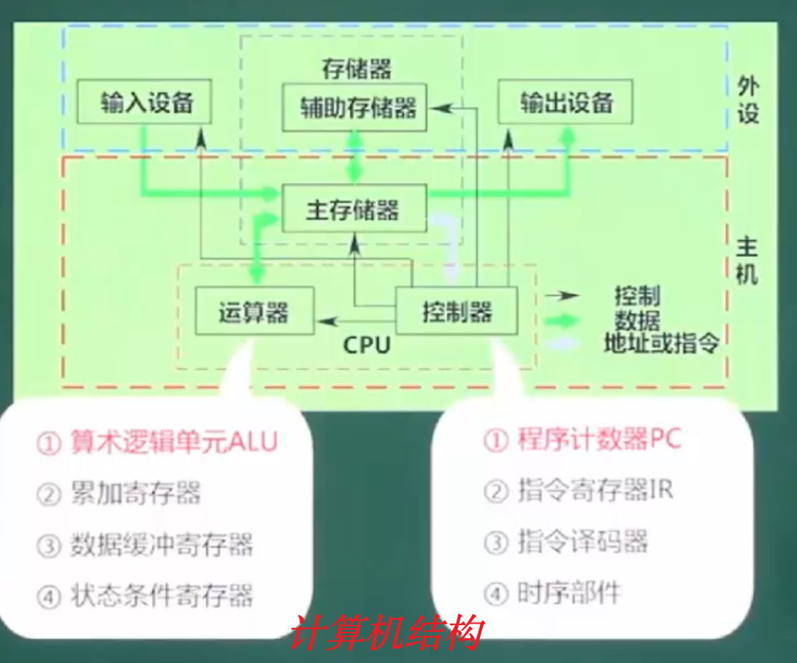 


从上图红色框我们发现计算机的主机主要由运算器、控制器、主存储器组成, 通俗点讲就是我们台式机的主机箱这一坨, 但是硬盘要排除在外, 我们在划分计算机的组成时, 主机的部分是不包括硬盘的, 这部分要注意下.  硬盘就是我们讲的外部存储器它是属于外设的一部分.


其次, 运算器和控制器是属于CPU的重要组成部分,在考试时很重要

- **运算器** 全部内容要记清楚

  - **算数逻辑运算单元  ALU**, 负责进行算数和逻辑运算

  - **累加寄存器 AC**, 也叫累加器也叫通用寄存器, 它是给算数逻辑运算单元提供一个工作区,用于存储零时的算数运算结果和逻辑运算结果. 

  - **数据缓冲寄存器DR**, 写内存时,暂存指令或数据

  - **状态条件寄存器PSW** , 比较特殊,存储状态标志与控制标志, 比如: 进位、溢出、清零 等这些状态. (有争议, 也有将其归纳为控制器的, 需要注意)

    > 状态条件寄存器怎么个特殊呢? 比如出一道题,请问下面ABCD4个选项,那个属于**控制器,** 其中一个就是**状态条件寄存器**, 这时你就不要选错了, 状态条件寄存器属于 运算器 ⭐️⭐️ 因为在历年的考试中有时把状态条件寄存器归类到运算器, 有时归类到控制器, 不要先排除它. 

- **控制器**(5个记住)  ⭐️

  - **程序计数器PC**, 记录CPU下一条要访问的指令地址
  - **指令寄存器IR**, 是存储指令的,指令从存储器里面读出来暂存
  - **地址存储器DR**, 是用来存储记录CPU当前要访问的指令地址的. 
  - **指令译码器ID**, 我们给计算机发一条指令,计算机不懂,所以要翻译, 对指令中的操作码进行分析解析
  - **时序部件**, 就是什么时候干什么样的事情,按照什么顺序来做, 最典型的就是脉冲波. 提供时许控制信号. 


下面我们讲一个程序的例子来让大家快速的理解什么是控制器, 我们知道一段程序都是有很多语句构成的, 如果我们把每条语句当成一条指令, 我们程序写完之后会需要一定的顺序编码, 按照一定的顺序执行的. 

指令寄存器用来读写一条条的指令地址, 地址存储器用来存储当前要执行的指令地址,程序计数器用于指定要执行的下一条的指令, 指令译码器用来说明每条指令需要怎么翻译, 时序部件用来控制顺序


> 其实很简单, 把程序的执行流程记清楚, 控制器就记清楚了, 控制器记住了运算器就记住了. 


### 2、计算机体系结构-Flynn

计算机体系结构分类 Flynn 分类,这是一个经常的考点, Flynn 分类法我们是要求掌握的. 

⭐️ Flynn分类法是**从微观的角度**,按照**并行的程度**来对计算机进行分类的一种方法

>  有个著名的美籍华人: 冯泽云, 他也是以微观的角度, 并行的程度,对计算机结构进行了一个分类. 

指令-控制器发出, 数据流-处理器处理

|序号| 体系结构                  | 结构                                            | 关键特性                                       | 代表                                       |
| ------------------------- | ------------------------- | ----------------------------------------------- | ---------------------------------------------- | ------------------------------------------ |
|1| 单指令流 单数据流<br>SISD | 控制部分:一个<br>处理器:一个<br>主存模块: 一个  |                                                | 单处理器系统                               |
|2| 单指令流 多数据流<br>SIMD | 控制部分:一个<br>处理器:多个<br>主存模块:多个   | 各处理器以异步的形式<br>执行同一条指令         | 并行处理机<br>阵列处理机<br>超级向量处理机 |
|3| 多指令流 单数据流<br>MISD | 控制部分:多个<br>处理器:一个<br>主存储模块:多个 | 被证明不可能,至少是不实际                      | 目前没有, 有文献称<br>**流水线计算机**为此类,<br>到目前没有发明成功 |
|4| 多指令流 多数据流<br>MIMD | 控制部分:多个<br>处理器:多个<br>主存模块:多个   | 能够实现**作业、任务、指令**等<br>各级全面并行 | 多处理机系统<br>多计算机                   |

>  1. 必须要记住Flynn 分类法的每种分类对应的代表机型, 比如: 单指令流多数据流 --> 并行处理器/阵列处理机/超级向量处理机
>
>  2. 针对第2中SIMD, 既然有多处理器就会有几种代表,并行处理器/阵列处理机/超级向量处理机,所谓这些分类就是将多个处理器按照不同的规则排列 , 并行就按照平行排, 阵列就按照阵列排等
>  3. 针对第3中MISD, 只有一个CPU要干很多事情, 证明是不可能的. 
>  4. 针对第4种, 是我们现在用的比较多的. 


### 3、指令的基本概念

**一条指令就是机器语言的一个语句, 它是一组有意义的二进制码, 指令的基本格式如下:**

| 操作码字段 | 地址码字段 |
| ---------- | ---------- |

- **操作码**部分指明了计算机要执行什么性质的操作, 比如: **加法、减法、取数、存数等.** 

- **地址码**字段需要包含各操作的地址及操作结果存放地址等,从其结构的角度可以分为**三地址指令、二地址指令、一地址指令、零地址指令**

  > 换言之, 操作码用来描述操作, 地址码用来描述操作的数存储在哪里
  
  | OP   | A<sub>1</sub> | A<sub>2</sub> | A<sub>3</sub> |
  | ---- | ------------- | ------------- | ------------- |
  
  > 所谓的三地址指令, 指的是一个操作码,三个地址码, OP代表操作, A1/A2/A3 用来存储操作的数,比如:  a+b=c
  
  | OP   | A<sub>1</sub> | A<sub>2</sub> |  
  | ---- | ------------- | ------------- |  
  
  >  所谓的二地址指令, 指的是一个操作码,二个地址码, OP代表操作, A1/A2 用来存储操作的数, 比如:a += b
  
  | OP   | A<sub>1</sub> | 
  | ---- | ------------- |  
  
  >  所谓的一地址指令, 指的是一个操作码,一个地址码, OP代表操作, A1 用来存储操作的数, 比如: a++
  
  | OP   |  
  | ---- |  
  
  > 所谓零地址指令, 指的是只有一个操作码,没有地址码, OP代表操作,比如: exit 指令

我们介绍指令, 是为后面的流水线做准备的.


### 4、寻址方式

- **立即寻址方式:** 

  **操作数**直接在指令中, 速度快,灵活性差

  > 换句话说, 立即寻址就是数据直接存储在指令里, 直接操作数, 类似于程序中直接操作数

- **直接寻址方式:**

  指令中存储的是**操作数的地址**

  > 换句话说, 直接寻址,就是说指令里面存储的是操作数的地址, 通知指令可以直接拿到操作数的地址找到操作数进行操作. 类似于程序中的变量赋值

- **间接寻址方式:**

  指令中存放了一个地址, 这个地址对应的内容是操作数的地址

  > 类似于程序中的指针的指针操作

- **寄存器寻址方式:**

  寄存器存放操作数

- **寄存器间接寻址方式**

  寄存器内存放的是操作数的地址

其实, 还有其它几种寻址方式, 但是在软件设计师的考试中,只考上面这几种就够了. 


### 5、复杂指令集(CISC)与精简指令集(RISC)


#### 1、复杂指令集与精简指令集介绍

根据计算机**指令系统的类型**, 我们又可以把计算机划分为精简指令集(RISC) 和 复杂指令集(CISC)两大类.

> 复杂指令集,指令很复杂,各种难记, 精简指令集,指令很精简,好记.

| 指令系统类型 | 指令                                                         | 寻址方式   | 实现方式                                                     | 其它                          |
| ------------ | ------------------------------------------------------------ | ---------- | ------------------------------------------------------------ | ----------------------------- |
| CISC(复杂)   | **数量多**, 使用**频率差别大**<br>**可变长格式**             | 支持多种   | 微程序控制技术<br>(微码)                                     | 研制周期长                    |
| RISC(精简)   | **数量少**,使用**频率接近**<br>**定长格式**,大部分为**单周期指令**<br>操作寄存器,只有load/store操作内存 | 支持方式少 | **增加了通用寄存器**<br>**硬布线**逻辑控制为主<br>适合采用**流水线** | 优化编译,<br>有效支持高级语言 |

> - 顾名思义, 复杂指令集系统, 它的指令数量多,而且有的指令长有的指令短, 指令的使用差别大, 而且每个指令的使用频率差异大. 
>
> - 精简指令集, 它的指令比较简单, 它的指令格式采用的是定长的格式, 长度固定的, 每个指令都一样长. 大部分是单周期指令, 但是有个特点, 精简指令集在实现的时候相较于复杂指令集增加了通用寄存器,采用的是硬布线逻辑控制, 当然, RISC精简指令集因为其指令长度一样,格式也相对固定, 对于我们人来说相对简单点,不会像复杂指令集一样需要记住一大堆长短格式不一样的指令,很难记,而且有些指令使用频率很低.因为精简指令集对外提供的指令比较统一,对于人来使用时简单, 但是对于底层来说实现要比复杂指令集的逻辑复杂的多.  (这就和我们写程序是一个概念, 对外的接口简单了, 内部的逻辑肯定要复杂写,各种情况要考虑, 反之亦然) 所以精简指令集底层要提供的库肯定比复杂指令集要多很多.

最开始生产的电脑基本是采用复杂指令集RISC, 随着技术的发展精简指令集(CISC)是趋势, 技术越来越先进. 


#### 2、复杂指令集(RISC)与精简指令集(CISC)对比

可以从下面这些维度进行对比:

**指令的数量、指令的使用频率、寻址方式、寄存器、流水线支持、高级语言支持**


- **复杂指令集:**

  指令复杂(长短格式不一)、指令数量多,不同的指令使用频率差异大、多寻址(寻址方式很多)

- **精简指令集:**

  指令精简(定长格式)、指令数量少、单周期、少寻址(寻址方式比较少)、多通用寄存器、**流水线**

> 对于CPU设计者来说, 复杂指令集方案的实施更简单, 精简指令集的更难, 因为精简指令集要考虑更多的指令的一致性等设计原则.
>
> 对于上层开发者(指令的操作者)来说, 复杂指令集更麻烦, 精简指令集更简单, 因为精简指令集指令更统一, 复杂指令集指令五花八门难记


## 3、流水线

### 1、流水线概念介绍

- **相关参数计算:**

  流水线执行的**时间计算**、**流水线吞吐率**、流水线加速比、流水线效率

- 流水线是指在程序执行时 **多条指令重叠进行操作** 的一种准并行处理实现技术. 各种部件同时处理是针对不同指令而言的,他们可同时为多条指令的不同部分进行工作, 以提高各部件的利用率和指令的平均执行速度. 

​	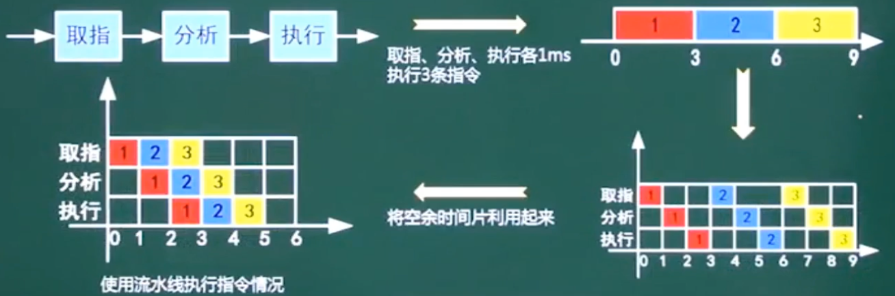 

> 换句话说, 流水线就是把原来的一个大的任务,拆分, 每个指令只做一件事


### 2、流水线计算

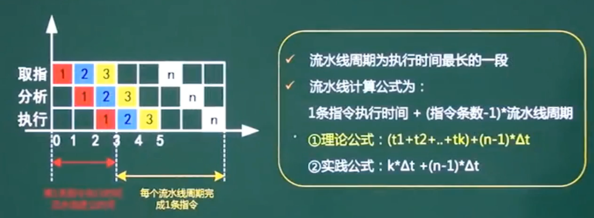 

一条指令的执行过程可以分解为**取值、分析、和执行**三步.若取值时间T1 = 3Δt, 分析时间T2=2Δt,执行时间T3=4Δt的情况下问:

1. 若按串行方式执行, 则10条语句全部执行完成需要多少时间? 
2. 若按流水线方式执行, 一个流水线周期多少时间?  10 条语句全部执行完毕需要多少时间?

```
# 串行方式所需时间:
1指令执行完成需要时间T = T1+T2+T3 = 3Δt + 2Δt + 4Δt = 9Δt
10条指令串行执行完毕时间= 10 * T = 10 * 9Δt = 90Δt

# 流水线方式
一个流水线周期就为流水线步骤中最长的一个步骤的时间,此处为执行时间T3.(即流水线周期为4Δt)
# 流水线时间计算公式为, 第一条指令执行的总时长 + (指令条数-1)*流水线周期,因此10条指令执行完所需的时间为:
(T1+T2+T3) + (10-1)*T3 = (T1+T2+T3) + 9*T3 = 9Δt + 9*4Δt = 45Δt
```

> 说明:
>
> 上面我们讲的流水线时间公式:  **T = 第一条指令执行的总时长 + (指令条数-1)*流水线周期** 是理论公式, 第一条指令执行的时间是各个步骤的真实时间之和, 但是在软考的时候往往用理论公式计算的结果找不到答案, 此时我们就要用流水线计算的**实践公式来计算.** 
>
> 所谓的流水线实践公式计算, 是指我们在计算第一条指令所需的时间时不再使用每个步骤的真实时间叠加, 我们给它每一步更充足的时间, 第一条指令的每个步骤都用流水线周期来算, 比如: 第一条指令有3个步骤: 读取、分析、执行, 那么它执行完成需要3 * 4Δt  , 剩余9条指令执行完成需要 9 *4Δt ,这样共计: 48Δt (比真实时间稍长 )


### 3、流水线理论公式和实践公式图解

- **流水线理论计算公式**

  ```
  (t1 + t2 + t3 + ...) + (n-1)*Δt
  # t1、t2 、t3... 表示的是一条指令执行时每一步骤耗时
  # Δt 表示 t1、t2 、t3... 中最耗时的一个步骤的耗时时间 (即流水线周期) 
  ```

- **流水线实践计算公式**

  ```
  m*Δt + (n-1)*Δt
  # 实践计算公式与理论公式的唯一不同点是第一条指令的每个步骤的计算时间都是用的是流水线的周期(即最耗时操作时长) 这样保证第一条指令有充分的完成时间
  ```
  
  > 换句话说, 流水线中, 实践计算公式中每个步骤的执行时间都是 流水线的周期(即流水线最长步骤时间)
  >
  > 从这样来看的话, 如果我们想要提高流水线的效率的话, 就必须保证流水线的每个步骤时间尽量相近或 相等, 如果步骤之间的时间差异大的 话那么流水线的效率也会很低. 

​	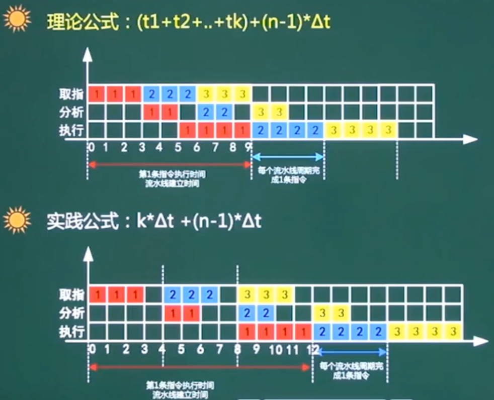 

> 从图上可以看出, 实践公式, 第一条执行计算时每一步都给出充分的时间(用流水线周期计算)


### 4、超标量流水线

超标量流水线, 即超过**标量**的流水线(即流水线的数量> 1), 明白了概念就 好做题了. 

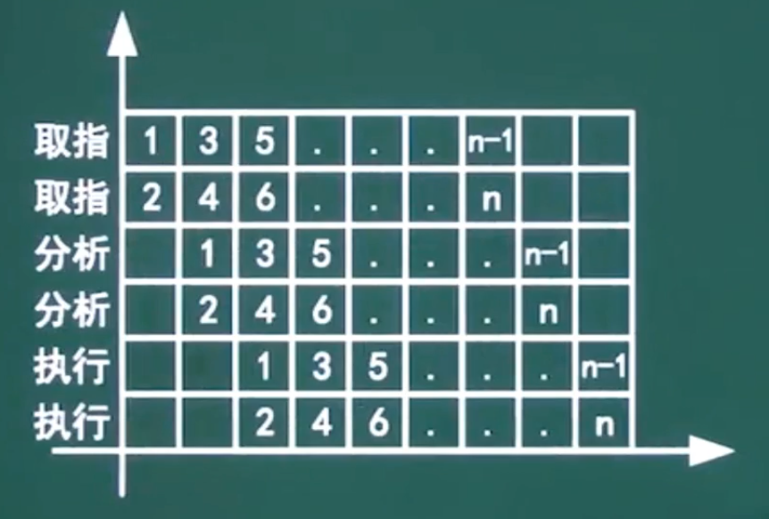  

超标量流水线有个名词: **度**, 讲度的话大家可能不是很明白.  

我们从上图分析可以发现: **同时有2个取值操作**、**同时有2个分析操作**、**同时有2个执行操作**, 因此图中有2条流水线. **也就是说由2条流水线组成的超标量流水线 度 为2.**

换句话说, 度为2同时可以进行2个操作.(打重点)

**比如说我们有10条指令需要执行的话, 我们度为2的超标量流水线的时间应该怎么算呢?** 

因为我们有2条流水线, 10 条指令执行的时间 = 一条流水线 执行5条指令的时间, 即: SUM = (10 / 2) * T = 5T

> 即,我们有n条流水线, 有m条指令需要执行, 那么执行需要的时间 和 一条流水线执行 m/n 条指令是对等的.
>
> **超标量 流水线, 其实就是增加流水线**,  标量是1嘛, 超过1不就是超标量了嘛


### 5、流水线吞吐率计算

- **流水线的吞吐率**(Though Put rate, TP)**是指在单位时间内流水线所完成的任务数量或输出的结果数量**

  公式如下:

  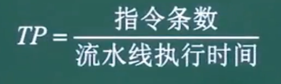  

  > 流水线吞吐率(TP) =  单位时间执行的指令条数(即指令条数/执行时间) 

  

- 流水线最大吞吐率:

  公式:

  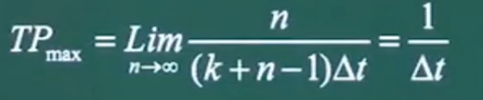 

  > 极限值就是流水线周期分之一, 即没有浪费的时间, 全部时间都用来执行指令了.

  


## 4、存储系统

我们计算机的存储系统里面, 有按层次划分存储结构, **我们称为层次化存储结构.** 


### 1、层次化存储结构

在了解存储结构前, 我们需要先了解计算机的存储结构, **为什么要按照层次进行划分呢?**

讲简单点,直接一点,存储结构层次划分的一个主要原因就是经济成本的问题, 如果我们的CPU便宜一点的话我们根本不需要内存. 我们把所有的内存都放到CPU里面去就可以了, 但是事实上我们CPU内部的存储空间很精贵. 到目前位置也就做到了**一级缓存、二级缓存**, 三级缓存很少见. 并且存储的容量都比较小**(基本都是几Kb)**

   

从上图我们可以看出, 层次化的存储结构主要划分为:  

**寄存器(**CPU内部)、**缓存**Cache(CPU内部)、**内存**(ROM/RAM)、**外存**(辅助存储器:硬盘、光盘、U盘等), 按照排列的先后顺序**速度越来越慢, 空间越来越大.** 


### 2、缓存Cache (重点)

在我们软考中,  需要重点掌握 **缓存Cache**这一层存储结构, 是一个重要的考点. 

**缓存Cache 是按内容存取的.** 所谓按内容查找,它是以找关键词, 通过关键词能检索出对应的内容. 


#### 1、缓存Cache 概念

- 在计算机的存储体系中,Cache 是连接CPU与内存的桥梁,让计算机可以快速的响应用户的操作,  **Cache是访问速度最快的层次. (若有寄存器, 则寄存器最快)**

  > 换言之, 在计算机中,Cache是除寄存器外最快的存储层次. 
  >
  > (有些地方也理解为Cache的访问速度是仅次于CPU的) 到时不要反应不过来. 

- 使用Cache改善系统性能的依据是**程序的局部性原则**

  所谓局部性原理, 又分为**时间局部性和空间局部性**

  > - 所谓的**时间局部性**, 就是指一段程序或者一段内容刚刚被访问过,接下来又可能被访问, 我们称为时间局部性.这个时候我们不会对它进行优先淘汰. 
  > - **空间局部性**,是指我这一段程序块,也就是地址空间的这个区域已经被访问过了,它旁边的空间有可能会被访问.
  >
  > 基于,时间局部性和空间局部性的原理**可以防止抖动**(就是电脑会闪屏的), 有了这个技术后,我们现在基本上看不到电脑会有闪屏的现象. 几遍有闪屏也看不出来. 这就是局部性原理的支撑. 

- 如果以h代表对Cache的访问命中率, t1 表示Cache的周期, t2表示主存储器周期, 以读操作为例:

  使用**"Cache + 主存储器"**的系统平均周期为t3, 则:

  ```
  t3 = h*t1 + (1-h)*t2
  # 其中h表示命中, 1-h 表示的就是失效, 计算出的时间 t3 就可以用来衡量我们的计算机的性能
  # 其实上面的公式很好理解, 在cache里面就在cache中找, 不在就在主存中找. 把他们平均后就是计算机的平均周期  
  ```
  
  对于Cache来说, 有个名词叫 **命中**, 什么是命中呢? 
  
  就是说我们CPU要访问这个内容或者数据时, CPU发现要访问的内容或者数据正好在cache里面, 这时我们就称为命中. 否则就称为失效.  因为我们的cache容量是有限的, 因此就会出现命中率的概念. 
  
  > 即, 缓存+主存的生命周期 = 缓存命中率\*cache周期 + (1- 命中率)\*主存周期


#### 2、Cache--映像

我们前面讲过了,Cache是按内容查找的. Cache的映像的主要划分为3种:

**直接相联映像、全相联映像、组相联映像**, 在了解Cache的映像时我们要了解它的特点

- **直接相联映像:** 

  直接相联映像(也可以理解为地址直接映像), 访问效率很高,硬件电路较简单, 但**冲突率很高**频繁的切换(淘汰)区

- **全相联映像:**

  电路难以设计和实现,只适合于小容量的Cache,**冲突率较低.**

- **组相联映像:**

  直接相联与全相联的折中, **即组相联冲突率在中间**

  > 有了上面的介绍, 我面如果提到Cache的映像的话, 你要知道, Cache直接相联映像冲突率最高,Cache全相联映像冲突率最低, Cache组相联映像冲突率折中. 


##### 1、地址映像(!!!)

什么是地址映像呢? 

所谓**地址映像就是将主存与Cache的存储空间划分为若干大小相同的页(或称为块**) 下面我们举个例子来说明下, 什么是 直接相联映像, 什么是全相联映像

例如: 

某主机的存储容量(简称主存)为1GB, 划分为**2048页, 每页512KB**; Cache容量为8MB, 划分为16页, **每页512KB**, 如下图: 

> 有没发现,主存的中每页的大小和缓存中每页的大小一样, 都是512kb, 只是页码数量不一样, why ?
>
> 这个是地址映像的特点(或者说基础) 就是主存与缓存都有大小相同的存储页或者存储块

 

从上图我们可以看吃出, 我们将1GB的空间划分为(0~2047)**2048页**和(0~127)**128个区**(算下来**每个区16页**), 而Cache划分为(0~15)**共16页**,  发现没主存的每个区的大小其实和缓存总大小是一样的, 这不是巧合这是设计, why? 我们后面会细说

###### 1、直接相联映像


所谓的直接相联映像, 是指缓存Cache的第0页区域只能存储主存中对应区中的第0页区域的内容, 缓存Cache的第n页区域只能存储主存中对应区中的第n页区域的内容

> 简单的说我们以缓存的第2页区域, 可以存储的主存的对应区域有 (第0区的第2页 或 第1区的第2页 或 第2区的第2页 ... 第127区的第2页 )
>
> 缓存的容量与主存的区的容量一样大, 缓存中一个页的大小和主存中页的大小一致.

这样存储的好处是, 我们只需要在缓存中存储**主存标记、cache页码、页码地址**就能快速找到内容(效率极高), 如下图: 

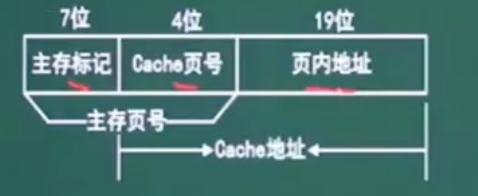 

> 主存标记+cache页码 => 主存页号

但是这样存储也有一个缺点呀, 缓存中的一个页码在同一时刻只能存储主存中一个区的对应的一个页码信息, 这样导致一个问题, 比如, 缓存的第1页上一个时刻存储的是主存第1区第1页, 下一刻又切换到了第2区的第1页... 以此类推, 最后的问题就是冲突率很高. 这就有点违背我们前面讲到的局部性原理(时间局部性/空间局部性), 我们下次还要用缓存啊, 你都把它淘汰了这样没法用啊.

> 所以说直接相联它的冲突率是最高的(淘汰率高), 但是它的访问速度最快(因为它不需要查地址, 地址已经描述好了)
>
> 简单的理解, 直接相联映像就是cache的一页对应主存的一区的一页(整个缓存的大小就是主存一个区的大小)


###### 2、全相联映像

前面说了, 直接相联映像,硬件电路简单,访问速度快, 但是冲突率极高,与我们的局部性原理(时间局部性/空间局部性)冲突相违背, 因此全相联映像就出场了. 

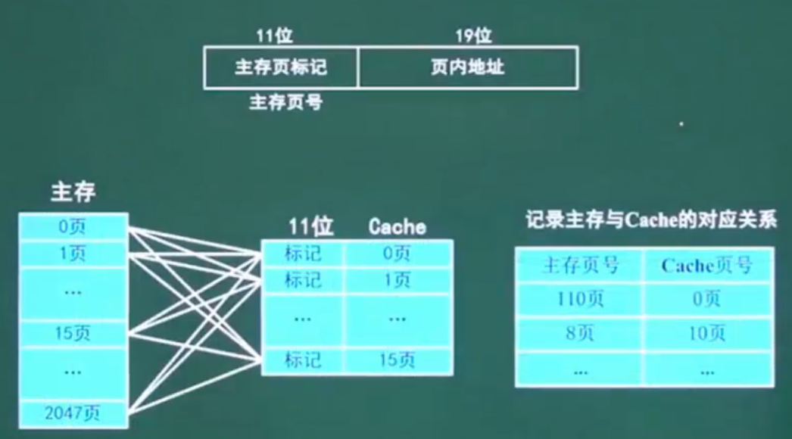 

所谓全相联映像, 就只指主存中的每一页都可以存放到cache里面去, 换句话说Cache里面的任何一页可以存储(对应)主存中的任何一页. 应为他们的size都是一样大, 都是512KB.  这样的话解决了可以任意存储的问题, 但是主存与Cache之间蜘蛛网一样的关系就复杂了, 那我们查找起来是不是比较麻烦些, 但是全相联映射的冲突问题确实比直接相联映像降低了很多. 不会像直接地址相联一样后存入的将先存入的直接淘汰, 有空间就直接存, 没空间才淘汰.

> 全相联映射是冲突率最低的, 但是查起来比较复杂. 
>
> 简单的理解, 全相联映像就是cache一页对应主存的任意 一页


###### 3、组相联映像

前面我们讲过了直接相联映像访问快冲突率高, 全相联冲突率低但是查找麻烦, 因此组相联就出现了.

 

**先分区, 再分组**

从上图我们可以发现, **组相联映像其实是直接相联映像和全相联映像的组合版本**. 将直接相联映像里面的区分为一组一组的.  将cache页分为一组一组的. 组内采用全相联映像, 组与组之间采用直接相联映像.

> 换句话说, cache 中的第0组只可以访问主存中年的第0区的第0组 ,  第1区的第0组, 第2区的第0组  ... 第 n区的第0组, 其它的组不能访问.
>
> cache中的第1组中的每页, 可以访问第0区的第一组内每一页, 可访问第1区的第一组内的每页 ... 可以访问第n区中的第1组内的每一页, 其它的不能访问
>
> 即, 前面讲的组相联映像中的组采用直接相联映像, 组内的页采用全相联映像. 

前面我们讲地址映像时有说过, 地址映像的基础是主存和cache有相同大小的页(块)512kb,  我们在介绍直接相联映像时有发现一个特点, 主存被划分一个个的区(一个区有划分为一个页/块), 每个区的大小和cache的大小一样(16页).每个区被划分为一页一页的, cache被划分为一页一页的, 主存中的页的大小和cache中的页的大小一样512KB.

前面我们已经总结了

- 直接相联映像硬件简单,访问速度块冲突率高, 与我们的局部性(时间局部性/空间局部性)原理相违背 .

- 全相联映像,访问速度慢, 冲突率最低

- 组相联映像折中

  


### 3、主存-编址与计算


#### 1、存储单元

对于我们的主存编址来说有很多的编址方式, 有统一编址方式, 有不统一编址方式. 总体来说有按字编址, 有按字节编址两种.

-  **按字编址:** 

  存储体的存储单元是字存储单元, 即最小寻址单位是一个字

  > 在考题的时候, 如果采用按字编址会告诉我们字长是多少. 

- **按字节编址 :**

  存储体的存储单元是字节存储单元, 即最小寻址单位是一个字节

  > 一个字节  = 1Byte = 8bit , 即一个字节表示8个二进制位 

根据存储器所要求的容量和选定的存储芯片的容量, 就可以计算出所需的芯片的总数,即 :

```
总片数 = 总容量 / 每片容量
```

例如:

若内存地址区间为 4000H ~ 43FFH ,每个存储单元可以存储16位二进制数, 该内存区域用4片存储芯片构成.则构成该内存的存储的存储器芯片的容量是多少? 

```
# H表示的是十六进制  hex 
# 其实, 一直有很多人搞不清楚从一个区间到另外一个区间的大小
# 总容量计算公式:
43FFH - 4000H + 1 = 400H # 一定要加1
400H => 二进制为 100 0000 0000  (2的十次方)
# 因为题干说每个存储单位存储16位二进制, 说明是按字编码, 此处16位1个字表示2个字节
400H * 16bit => 100 0000 0000 * 16bit => 1024 * 16bit = 1024 * 2byte 
1024 * 2byte / 4 = 256 * 2byte = 512Byte 
```


#### 2、总线

总线是计算机各硬件设备之间连接的桥梁.一个总线**同一时刻仅允许一个设备发送, 但允许多个设备接收.** 就像广播一样只有拿到话筒的人才能讲话, 但是都可以听见 总线可以分为: 

内部总线、外部总线、以及系统总线, 我们经常说的总线主要指: 数据总线、地址总线、控制总线. 

##### 1、总线的分类:

- **数据总线(Data Bus):** 

  数据总线是用来传输数据的, 一般在CPU与RAM之间来回传输需要处理或需要存储的数据

- **地址总线(Address Bus):**

  地址总线是用来传输地址的, 一般用来指定在RAM (Random Access Memory)之间存储的数据的地址.

- **控制总线(Control Bus):**

  控制总线是用来传输控制命令的, 将微处理器控制单元(Control Unit)的信号传送到周边设备, 一般常见的为 USB Bus 和1394 Bus


### 4、串联系统与并联系统

求串联系统 与 并联系统的可靠性(可靠度)

一般来讲系统有三种, 一种是串联系统, 一种是并联系统, 还一种是混合的有串联也有并联

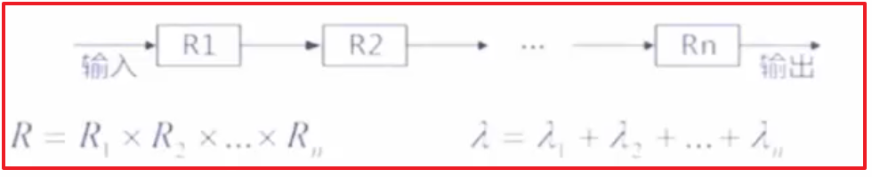 

上面这个图就是串联系统, 与我们初中时学习的物理串联电路类似 , 一个个的电阻串联圈起来.  当然我们上图中的R与物理将的电阻不同, 这里的R表示的是可靠性. 在我们串联系统中计算可靠性时把所有的串联的可靠性全部乘起来就得到了最终的可靠性. 图中的λ表示的是失效, 将所有的λ加起来就的到总的失效

```
R  = R1*R2*R3...*Rn # 得出串联系统总的可靠性
λ = λ1+λ2+λ3 ...+λn # 得出串联系统总的失效
```

> 一般我们在考试时, 串联系统将所有的可靠性乘起来就得到了最后的总的可靠结果了


下图时并联系统

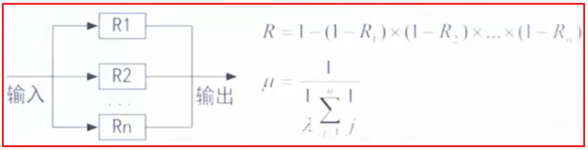 

我们在计算串联系统时是将所有的可靠性乘起来, 但是在并联系统中这样显然是不对的, 一般来说我们在并联系统中是将所有的失效乘起来得出一个总的失效, 然后1-总 的失效就得到了总的可靠性. 串联系统只要有一个是可靠的结果就是可靠的. 

```
# R1,R2,R3 表示的是可靠性
λ1 = (1-R1) # R1的失效
λ2 = (1-R2) # R2的失效
λ3 = (1-R3) # R3的失效

R = 1-(1-R1)*(1-R2)*(1-R3)
```


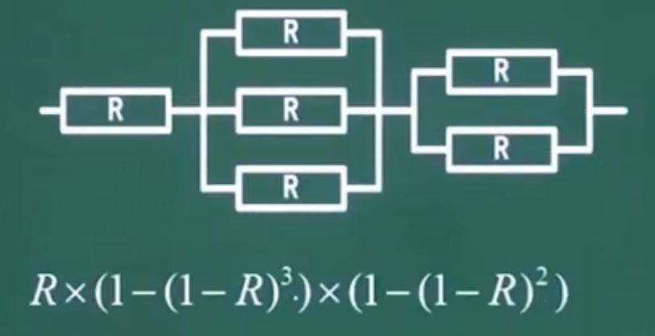  

前面我们介绍过了串联系统 和并联系统的可靠性计算方式, 那混合型的怎么计算呢?

其实很简单, 我们先将混合系统中的并联系统一个个的计算出来就得出串联系统中的一个节点, 最后将所有的节点乘起来就计算出了所有的串联系统了.

> 即先把并的算出来得出串联中的一个节点, 最后得到一个串


## 5、检验码

### 1、校验码基础知识

**码距:** 

任何一种编码都由许多码字构成, 任意两个码字之间最少变化的二进制位数就称为数据校验码的码距. 

例如:

用4位二进制表示16种状态, 则有16个不同的码字, 此时码距为1 (因为相邻的码只差1, 因此码距为1)

```
比如:
0000 -> 0001 只要有一位变化即可, 因此码距为1
0001 -> 0010 需要有2位变化才能办到, 因此码距为2
```


### 2、奇偶校验

其实我们**校验码**有很多种方式, 比如: 

一个是**奇偶校验**, 一个是**循环冗余校验**, 一个是**海明码校验**. 

既然有**校验**那么自然有**检错**和**纠错**.(换句话说校验分为检错的校验和纠错的校验)


**大家需要记住, 奇偶校验只有检错功能, 没有纠错功能, 而且只能检查1位的错误, 如果有2位或者2位以上的位发生错误可能检测不出来.**


奇偶校验的原理和流程大致是这样的:

> 比如: 我们有段数据需要传送, 传送时采用**奇校验**, 那么我们在传送前会先检测这段待传送的数中`1`数的个数, 如果`1`的个数为奇数那么在数据传送前在数据的末尾追加一个`0`, 否则追加一个`1` , 在接收到数据时判断接收到的数据中`1` 的个数是否是奇数, 如果是那么奇校验通过, 否则校验不通过.  偶校验的原理和奇校验的一样唯一的区别是判断`1` 的个数为偶数.  
>
> 1. 从上面的这段奇偶检验的原理我们可以知道, 奇偶校验只能检查一位数码的错误, 如果数据在传输时发生错误的尾数>1 可能检测不出来. 
> 2. 还有就是奇偶校验只知道有错, 但是不能纠错, 这点需要明白. 

- **奇偶校验码的编码方法是:**

  由若干位有效信息(如一个字节), 再加上一个二进制位(校验位)组成校验码

- **奇校验:**

  整个校验码(有效信息位和校验位)中 `1` 的个数为奇数

- **偶校验:**

  整个校验码(有效信息位和校验位)中`1` 的个数为偶数


### 3、循环冗余校验码CRC

**CRC循环校验码, 可检错, 不可纠错**


**循环冗余校验码CRC的编码方法是:**

**在K位信息之后拼接r位校验码**,应用CRC码的关键是如何从K位信息位简便地得到r位检验位(编码), 以及如何从K+r位信息码判断是否出错. 


循环冗余校验码编码规律如下:

- 把待编码的N位有效信息表示为多项式M(x)
- 把M(x)左移K位, 得到M(x) * X<sup>k</sup>, 这样空出了K位, 以便拼装K位余数(即校验位)
- 选取一个K+1位的产生多项式G(x), 对M(x) *X<sup>k</sup> 做模2除
- 把左移k位以后的有效信息与余数R(x)做模2加减,拼接为CRC码此时的CRC码共有N+K位

把接收到的CRC码用约定的生成多项式G(x)去除, 如果正确,则余数为0. 如果某一位出错则余数不为0. 不同的位数出错其余数不同,余数和从出错位序号之间有唯一的对应关系. 


什么是模2除法, 它和普通的除法有何不同?

模2除法是指在做除法运算的过程中不计其进位的除法.

例如: 10111 对 110 进行模2除法为:

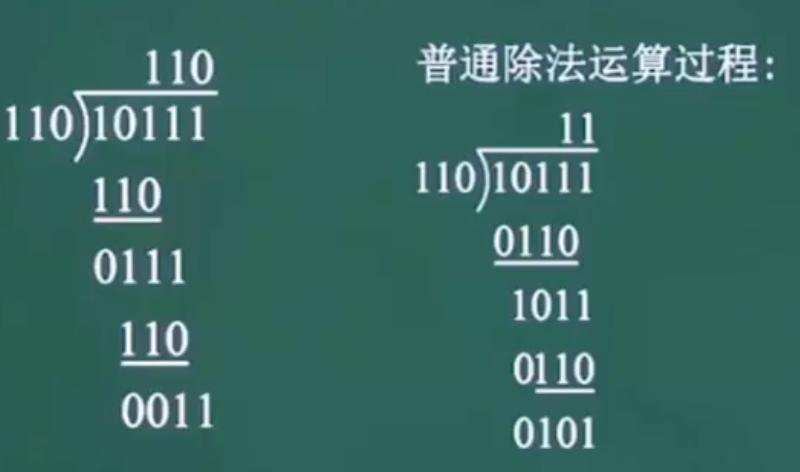 


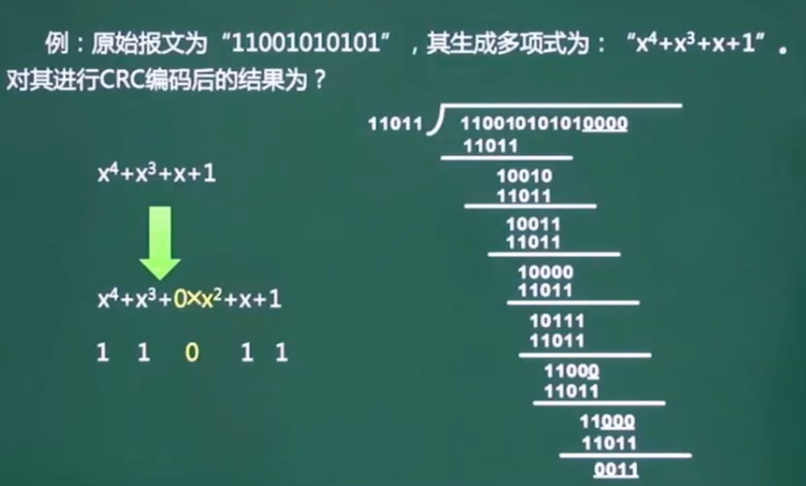  


### 4、海明校验码

**海明校验, 可检错, 可纠错**, 软考中只要知道海明码可以检错可以纠错就可以了, 不需要掌握其细节. 


海明校验码的原理是:

在有效信息位中加入几个校验位形成海明码, 使码距比较均匀的拉大, 并把海明码的每个二进制位分配到几个奇偶校验组中, 当某一位出错后, 就会引起有关的几个校验位的值发生变化, 这不但可以发现错误, 还能指出错误的位置, 为自动纠错提供了依据. 


我们需要知道, 海明码到底需要多少位校验位既可以检错页可以纠错

**2<sup>r</sup> >= m+r+1  , 其中 r 就是校验位的数量, m 是数据位, 这个海明码的公式需要记住**


