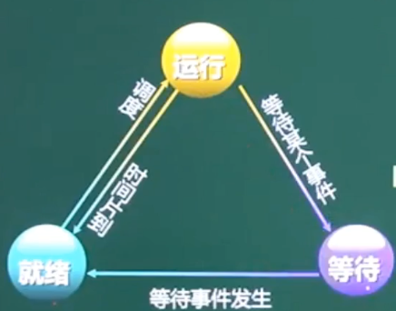
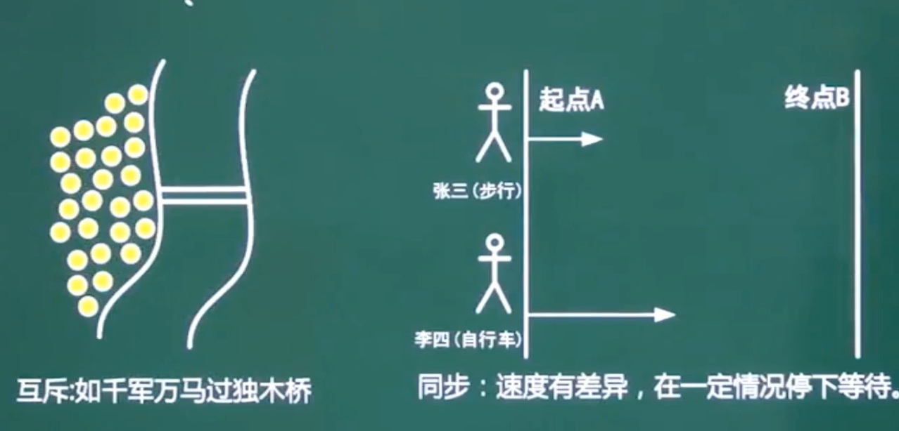
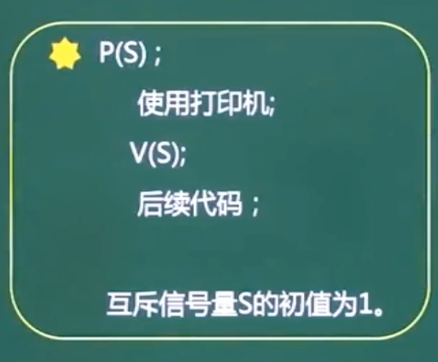
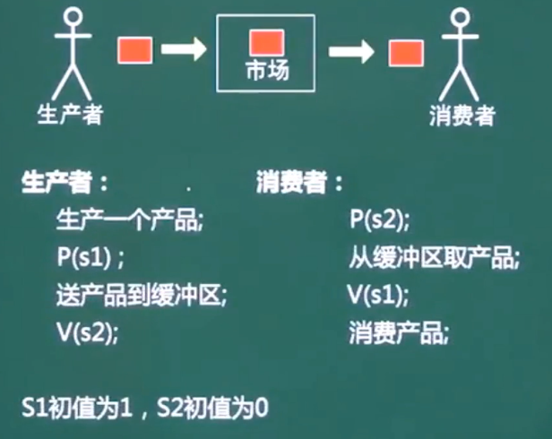

# 操作系统

操作系统在软考中有几个比较难的点. 每年有6~8分

这个章节主要停留在上午题, 选择题


考点主要体现在:

- 进程管理
  - 进程状态
  - 前趋图
  - 信号量与PV操作  (这个比较难)
  - 死锁及银行家算法
- 存储管理
  - 段页式存储
  - 页面置换算法
- 文件管理
  - 绝对路径与相对路径
  - 索引文件
  - 位士图
- 作业管理
- 设备管理
  - 虚设备与SPOOLING技术


## 1、进程管理

### 1、进程的概念

进程是程序在一个数据集合上运行的过程, 它是系统进行资源分配和调度的一个独立单位. 它由**程序块、进程块(PCB)和数据块**三部分组成. 

**进程与程序的区别:**

进程是程序的一次执行过程, 没有程序就没有进程. 程序是完成某个特定功能的一系列程序语句的集合, 只要不被破坏它就永远存在. 程序是一个静态的概念, 而进程是一个动态的概念. 它由创建而产生, 完成任务后因撤销而消失. 进程是系统进行资源分配和调度的独立单位, 而程序不是. 


### 2、进程的几种状态


#### 1、进程的三态模型

> 所谓进程的三态模型, 其实说的就是进程的**就绪、运行、等待(阻塞)** 三种状态的转换关系. 

- **等待状态**(阻塞状态) ----等待事件发生----> **就绪状态**

- **就绪状态** ----调度----> **运行状态**

  **运行状态** ----时间片到了----> **就绪状态**

- **运行状态** ----等待某个事件 ----> **等待状态**(阻塞状态) 

  > 有时等待状态也称为阻塞状态
  >
  > 当程序处于就绪状态时所需的所有资源都具备了,此时只缺CPU的资源(或者只缺CPU调度), 当CPU有空了调度任务这时就从就绪状态转换为运行状态. 
  >
  > 当CPU处于运行状态时, 有可能会需要等待某些事情的发生(比如: IO设备的输入输出 , 其它线程的操作响应等)这时CPU就会进入阻塞的状态 (即 等待的状态)
  
   
  
  从图上我们发现, 只有就绪状态和运行状态是可以相互转换的, 那么是在什么情况下就绪状态和运行状态是会相互转换的呢?
  
  >  有2种情况, 运行状态会发生转换为就绪状态
  >
  >  1. CPU的时间片到了用完了, 此时不能再给你用, 此时程序从运行状态直接切换到就绪状态. 
  >
  >  2. 进来一个优先级更高的线程, 那此时优先级低的线程就只能回到就绪状态. 释放资源让别人先用.
  >
  >  在就绪状态时, 就差CPU调度, CPU已调度程序就从就绪状态转换为运行状态. 


#### 2、进程的五态模型

总的来说, 五态模型就是在三态模型的基础上**增加了2种静止态. 静止就绪 和 静止阻塞**

 

**五态模型中, 一般什么情况会从 运行态 转换为 静止就绪态呢?**

>  在五态模型中, 一般从运行态转换为静止就绪态都是认为的操作, 比如: 我们听音乐的过程中,人为的点击暂停按钮. 这是 就从运行态  切换到了 静止就绪态

在 软考中, 重点掌握三态模型


### 3、进程的同步与互斥

 


- **什么是同步?**

  **同步**就是合作进程之间**直接**的制约关系. 

  比如, 

  上图中要求张三和李四同时到达终点, 但是张三和李四的速度不一样,这就要求李四(速度快的)等着张三,  这样他们之间就有一个直接的制约关系 ,  **这就称为同步.**  

  > 简单的说, 同步就是执行的快的等执行的慢的, 最后一起把事情做完

- **什么事互斥呢?**

  互斥就是多个或一个进程之间形成的**间接制约关系**. 这个间接的制约关系是因为他们要去**争夺临界资源**.  
  
  比如:
  
  上图中的独木桥就是临界资源, 只要有一个人在独木桥上, 那么千军万马也要等着,  这就间接的形成了制约关系, 我占了你就不能占, **这就是互斥.** 
  
  >  简单说, 互斥就是争夺临界资源


### 4、PV操作(申请释放资源)


#### 1、PV操作介绍 (信号量)

> 其实PV操作就是我们常见的一种信号量加锁.线程安全技术

在我们进程管理当中, PV操作就是我们对于临界资源共享的处理 方式.在PV操作中有几个名词大家要记住:  **临界资源、临界区、信号量**

- **临界资源(⭐️):**

  诸进程间需要**互斥方式**对其进行共享资源, 如果: 打印机、磁带等

- **临界区:**

  每个进程中访问临界资源的那段代码称为临界区.

- **信号量:**  整个PV中的核心

  是一种特殊的变量, 可以为正数也可以为负数, 当为负数时表示队列中有任务处于等待(阻塞)状态. 标记当前是否有可用临界资源

  > 当申请资源S=S-1后,即执行P(s)后, 信号量S小于0,表示现在没有可用临界资源, 需要进入等待(阻塞)状态
  >
  > 当释放资源后S=S+1后, 即执行V(s)后, 型号量小于等于0,表示释放前有线程处于等待(阻塞)状态, 需要唤醒.
  
  

**P**是荷兰语的**Passeren** (表示申请的意思), **V** 是荷兰语的**Verhoog**(表示释放的意思)

PV操作是成对出现的, 有申请就有释放. 

  

总的来讲, **PV操作**就是一种具体的**临界资源共享的方式,** 

对于P操作, **它是一个申请资源的操作.**

对于V操作, **它是一种释放资源的操作** .  

对于上图中的S, 表示的就是**信号量, 代表临界资源的总数**

>  **详解P操作(申请资源)的过程:**
>
> 当我们进行P操作(即, 申请资源)时,  **资源数s就会减少1**, s这个信号量代表的就是临界资源的总数, 当**S小于0时表示当前没有资源可分配了,** 程序就需要挂起, 这个时候其它的事情就会停下来进入阻塞状态.  如果信号量s分配后**大于等于0表示分配的资源还有**, 这个时候就可以继续执行. 
>
> **详解V操作(释放资源)的过程:**
>
> 相对于P操作来说V操作是一个释放资源的操作, 当释放资源的时候**信号量S会执行加1操作**,代表回收释放了一个资源, 然后会判断**信号量s是否小于等于0**, 如果小于等于0说明阻塞队列里面还**有任务处于阻塞状态在等待执行**, 这时我们就要**唤醒队列中处于等待(阻塞)的任务**, 现在有一个资源释放了你可以申请资源了, 如果资源释放后发现**S的值>0 说明阻塞队列里面是空的,** 这时直接做事情即可不需要做任何唤醒操作. 

这个PV操作把信号量讲的很清楚, 仔细思考其中的流程细节, 对写代码有帮助. 


#### 2、PV操作-互斥模型-争夺资源

**PV互斥模型的典型例子就是, 多个进程共享一台打印机(互斥模型)的情景, 同一时间只能有一个人使用设备.** 

> 简单的理解, 互斥就是争夺资源

- **P(s) 申请资源, 信号量S=S-1**, 当S<0时挂起(阻塞等待), 否则立即执行

- **V(s) 释放资源, 信号量S=S+1**, 当S<=0时队列有阻塞需要唤醒执行, 否则正常执行

 

互斥模型对于多进程来说它是因为争夺临界资源(打印机等), 一般情况下临界资源都是有限的都需要争夺. 

> 我们讲一个理发店的例子来说明:
>
> 理发店中只有一个师傅, 最开始的时候信号量S=1,  来了一个客人A1理发P(s)申请一个资源,  信号量S=S-1=0,  如果此时再来一个客人A2理发P(s)再申请一个资源, 信号量S=S-1 = -1这时A2挂起进入阻塞, 这时只有等到A1完成操作, 师傅释放资源V(s), 此时 S=S+1=0 唤醒A2, 然后A2 就可以执行后续操作了. 

**PV操作是成对出现的, 有申请就有释放** 


#### 3、PV操作-同步模型-生产者消费者

**PV同步模型, 典型的例子就是单缓冲区生产者、消费者问题**

> 什么是单缓冲区?
>
> 简单的理解就是一次只能有一个进程在那里执行. 


  

PV 的同步模型比PV的互斥模型要复杂有点. 上图中,我们介绍的PV同步模型, 是基于单缓冲区来说明的. 

> 什么是单换冲区呢? 
>
> 简单的讲, 单缓冲区就是指一次只有一个进程在那里执行. 

在介绍PV同步模型前, 我们先来了解下这里面的角色:

**生产者**: 生产者的任务就是负责生产

**消费者**:消费者的任务就是负责消费

**市场**:市场是用来存放产品的(可以理解为仓库的概念), 而且只能方一个. 市场的个数只有1个

**生产者消费者模型的重点在于两个信号量(两个临界资源), 即 生产的临界资源S1和消费临界资源S2. , 最开始的初始值为 S1=1, S2=0, 表示先生产再消费**


初始信号量S1=1,S2=0 这个很重要!!! 解题的前提

- **在生产这端:**

  在要执行生产动作前, 先申请生产临界资源P(s1), 表示说我这条线程要开始生产了,我要一个生产名额, 生产完成后执行V(s2) 表示增加一个消费名额(唤醒一个消费如果有消费阻塞) 

- **在消费这端:**

  在要执行消费动作之前, 先申请临界资源P(s2), 表示说我要开始消费了我要一个消费名额, 消费完成后执行V(s1)表示说我已经消费了一个你可以生产了(唤醒一个生产如果有生产阻塞)

> 其实, 生产者消费者的流程很好理解
>
> 第一步, 掌握两个临界资源S1和S2
>
> 第二部, 不论是生产者还是消费者, 要操作(生产 或者 消费)就先申请自己的临界资源 P(s), 有必要时进入阻塞
>
> 第三部, 操作完成, 释放对方的临界资源V(s)有必要时通知唤醒. 


#### 4、PV操作应用

某书店有一个收银员, 改书店最多允许n个购书者进入. 将收银员和购书者看做不同的进程,其工作流程如下图所示:

利用PV操作实现该过程, 设置信号量S1、S2 ... Sn, 初始值分别为 0, 1, ... n.则图中a1 和 a2 应填入_ _ _ _ _ _ , 图b1 和 b2 应填入_ _ _ _ _ _ 

 

```
A. V(s1), P(s2)	  B. V(sn), P(sn)
C. P(s1), V(s2)		D. P(s2), V(s1)

A. P(sn), V(s2)	  B. V(sn), P(s2)
C. P(s1), V(s2)		D. P(s2), V(s1)
```

> 首先, 我们分析这道题, 它是一个同步操作, 收营员就是一个被争夺的资源, 类似于我们生产者消费者中仓库的角色
>
> 这个提醒, 是软考中PV操作考的最多的一种题型, 一般出现就是2空, 甚至3空, 这种题必须拿分. 
>
> 拿到这种题, 我们要从收营员入手, 因为收营员只有一个. 
>
> 收银员做什么呢? 
>
> 最开始,当有人进来付款时收银员拿到购数码, 扫码收钱, 就是上图中的收费环节, 所以收银员最开始是在睡觉(等待阻塞状态), 他在等待消费者过来买书吧, 当收银员吧一个消费者的前收完后肯定会叫下一个消费者过来付款, 因此可以肯定 b1、b2 是一个PV操作, 且 b2一定是v操作(唤醒操作)是一个叫下一个消费者付款的操作, 因此b1 应该是p操作, 排除B答案, 因为收银员是从第一个人开始收钱, 因此 b1 = P(s1) 第一个付款者, b2 = V(s2) 第二个付款者


