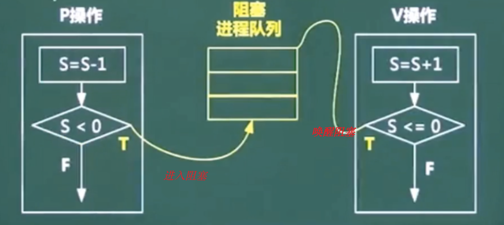

#  操作系统

操作系统在软考中有几个比较难的点. 每年有6~8分

这个章节主要停留在上午题, 选择题


考点主要体现在:

- 进程管理
  - 进程状态
  - 前趋图
  - 信号量与PV操作  (这个比较难)
  - 死锁及银行家算法
- 存储管理
  - 段页式存储
  - 页面置换算法
- 文件管理
  - 绝对路径与相对路径
  - 索引文件
  - 位士图
- 作业管理
- 设备管理
  - 虚设备与SPOOLING技术


## 1、进程管理

### 1、进程的概念

进程是程序在一个数据集合上运行的过程, 它是系统进行资源分配和调度的一个独立单位. 它由**程序块、进程块(PCB)和数据块**三部分组成. 

**进程与程序的区别:**

进程是程序的一次执行过程, 没有程序就没有进程. 程序是完成某个特定功能的一系列程序语句的集合, 只要不被破坏它就永远存在. 程序是一个静态的概念, 而进程是一个动态的概念. 它由创建而产生, 完成任务后因撤销而消失. 进程是系统进行资源分配和调度的独立单位, 而程序不是. 


### 2、进程的几种状态


#### 1、进程的三态模型

> 所谓进程的三态模型, 其实说的就是进程的**就绪、运行、等待(阻塞)** 三种状态的转换关系. 

- **等待状态**(阻塞状态) ----等待事件发生----> **就绪状态**

- **就绪状态** ----调度----> **运行状态**

  **运行状态** ----时间片到了----> **就绪状态**

- **运行状态** ----等待某个事件 ----> **等待状态**(阻塞状态) 

  > 有时等待状态也称为阻塞状态
  >
  > 当程序处于就绪状态时所需的所有资源都具备了,此时只缺CPU的资源(或者只缺CPU调度), 当CPU有空了调度任务这时就从就绪状态转换为运行状态. 
  >
  > 当CPU处于运行状态时, 有可能会需要等待某些事情的发生(比如: IO设备的输入输出 , 其它线程的操作响应等)这时CPU就会进入阻塞的状态 (即 等待的状态)
  
   
  
  **从图上我们发现, 只有就绪状态和运行状态是可以相互转换的, 那么是在什么情况下就绪状态和运行状态是会相互转换的呢?**
  
  >  有2种情况, 运行状态会转换为就绪状态
  >
  >  1. CPU的时间片到了用完了, 此时不能再给你用, 此时程序从运行状态直接切换到就绪状态. 
  >
  >  2. 进来一个优先级更高的线程, 那此时优先级低的线程就只能回到就绪状态. 释放资源让别人先用.
  >
  >  在就绪状态时, 就差CPU调度, CPU调度程序就从就绪状态转换为运行状态. 


#### 2、进程的五态模型

总的来说, 五态模型就是在三态模型的基础上**增加了2种静止态. 静止就绪 和 静止阻塞**

 

**五态模型中, 一般什么情况会从 运行态 转换为 静止就绪态呢?**

>  在五态模型中, 一般从运行态转换为静止就绪态都是认为的操作, 比如: 我们听音乐的过程中,人为的点击暂停按钮. 这是 就从运行态  切换到了 静止就绪态

在 软考中, 重点掌握三态模型


### 3、进程的同步与互斥

 


- **什么是同步?**

  **同步**就是合作进程之间**直接**的制约关系. 

  比如, 

  上图中要求张三和李四同时到达终点, 但是张三和李四的速度不一样,这就要求李四(速度快的)等着张三,  这样他们之间就有一个直接的制约关系 ,  **这就称为同步.**  

  > 简单的说, 同步就是执行的快的等执行的慢的, 最后一起把事情做完

- **什么事互斥呢?**

  互斥就是多个或一个进程之间形成的**间接制约关系**. 这个间接的制约关系是因为他们要去**争夺临界资源**.  
  
  比如:
  
  上图中的独木桥就是临界资源, 只要有一个人在独木桥上, 那么千军万马也要等着,  这就间接的形成了制约关系, 我占了你就不能占, **这就是互斥.** 
  
  >  简单说, 互斥就是争夺临界资源


### 4、进程PV操作(申请释放资源即加锁解锁问题)

其实进程的PV操作就是我们实际程序开发中的加锁与解锁问题

也即是资源的申请与释放操作


#### 1、PV操作介绍 (信号量)(重点)

> 其实PV操作就是我们常见的一种信号量加锁.线程安全技术

在我们进程管理当中, PV操作就是我们对于临界资源共享的处理 方式.在PV操作中有几个名词大家要记住:  **临界资源、临界区、信号量**

- **临界资源(⭐️):**

  诸进程间需要**互斥方式**对其进行共享资源, 如果: 打印机、磁带等

- **临界区:**

  每个进程中访问临界资源的那段代码称为临界区.

- **信号量:**  整个PV中的核心

  是一种特殊的变量, 可以为正数也可以为负数, 当为负数时表示队列中有任务处于等待(阻塞)状态. 标记当前是否有可用临界资源

  > 当申请资源S=S-1后,即执行P(s)后, 信号量S小于0,表示现在没有可用临界资源, 需要进入等待(阻塞)状态
  >
  > 当释放资源后S=S+1后, 即执行V(s)后, 型号量小于等于0,表示释放前有线程处于等待(阻塞)状态, 需要唤醒.
  
  

**P**是荷兰语的**Passeren** (表示申请的意思), **V** 是荷兰语的**Verhoog**(表示释放的意思)

PV操作是成对出现的, 有申请就有释放. 

  

总的来讲, **PV操作**就是一种具体的**临界资源共享的方式,** 

对于P操作, **它是一个申请资源的操作.**

对于V操作, **它是一种释放资源的操作** .  

对于上图中的S, 表示的就是**信号量, 代表临界资源的总数**

>  **详解P操作(申请资源)的过程:**
>
> 当我们进行P操作(即, 申请资源)时,  **资源数s就会减少1**, s这个信号量代表的就是临界资源的总数, 当**S小于0时表示当前没有资源可分配了,** 程序就需要挂起, 这个时候其它的事情就会停下来进入阻塞状态.  如果信号量s分配后**大于等于0表示分配的资源还有**, 这个时候就可以继续执行. 
>
> **详解V操作(释放资源)的过程:**
>
> 相对于P操作来说V操作是一个释放资源的操作, 当释放资源的时候**信号量S会执行加1操作**,代表回收释放了一个资源, 然后会判断**信号量s是否小于等于0**, 如果小于等于0说明阻塞队列里面还**有任务处于阻塞状态在等待执行**, 这时我们就要**唤醒队列中处于等待(阻塞)的任务**, 现在有一个资源释放了你可以申请资源了, 如果资源释放后发现**S的值>0 说明阻塞队列里面是空的,** 这时直接做事情即可不需要做任何唤醒操作. 

这个PV操作把信号量讲的很清楚, 仔细思考其中的流程细节, 对写代码有帮助. 


#### 2、PV操作-互斥模型-争夺资源(重点)

**PV互斥模型的典型例子就是, 多个进程共享一台打印机(互斥模型)的情景, 同一时间只能有一个人使用设备.** 

> 简单的理解, 互斥就是争夺资源

- **P(s) 申请资源, 信号量S=S-1**, 当S<0时挂起(阻塞等待), 否则立即执行

- **V(s) 释放资源, 信号量S=S+1**, 当S<=0时队列有阻塞需要唤醒执行, 否则正常执行

 

互斥模型对于多进程来说它是因为争夺临界资源(打印机等), 一般情况下临界资源都是有限的都需要争夺. 

> 我们讲一个理发店的例子来说明:
>
> 理发店中只有一个师傅, 最开始的时候信号量S=1,  来了一个客人A1理发P(s)申请一个资源,  信号量S=S-1=0,  如果此时再来一个客人A2理发P(s)再申请一个资源, 信号量S=S-1 = -1这时A2挂起进入阻塞, 这时只有等到A1完成操作, 师傅释放资源V(s), 此时 S=S+1=0 唤醒A2, 然后A2 就可以执行后续操作了. 

**PV操作是成对出现的, 有申请就有释放** 


#### 3、PV操作-同步模型-生产者消费者(重点)

**PV同步模型, 典型的例子就是单缓冲区生产者、消费者问题**  

  

PV 的同步模型比PV的互斥模型要复杂有点. 上图中,我们介绍的PV同步模型, 是基于单缓冲区来说明的. 

> 什么是单换冲区呢? 
>
> 简单的讲, 单缓冲区就是指一次只有一个进程在那里执行. 

在介绍PV同步模型前, 我们先来了解下这里面的角色:

- **生产者**: 生产者的任务就是负责生产

- **消费者**:消费者的任务就是负责消费

- **市场**:市场是用来存放产品的(可以理解为仓库的概念), 而且只能方一个. 市场的个数只有1个

**生产者消费者模型的重点在于两个信号量(两个临界资源), 即 生产的临界资源S1和消费临界资源S2 . 最开始的初始值为 S1=1, S2=0, 表示先生产再消费**


初始信号量S1=1,S2=0 这个很重要!!! 解题的前提

- **在生产这端:**

  在要执行生产动作前, 先申请生产临界资源**P(s1)**, 表示说我这条线程要开始生产了,我要占用一个生产名额,信号量s1=s1-1, 生产完成后执行**V(s2)** 表示增加一个消费名额或者生产出了一个产品, 信号量s2=s2+1

  > 当s1 = s1 -1申请资源后, 在生产前需要判断 s1 是否>=0, 即判断当前是否有资源可用, 如果>=0 表示有现成资源可用直接生产, 否则进入等待(阻塞)等待资源恢复后继续生产. 
  >
  > 当s2 = s2+1释放资源后, 需要先判断s2是否 <= 0, 即判断此时消费端是否有消费者处于等待阻塞状态, 如果<=0 需要唤醒消费, 否则 继续执行

- **在消费这端:**

  在要执行消费动作之前, 先申请临界资源P(s2), 表示说我要开始消费了我要一个消费名额, 消费完成后执行V(s1)表示说我已经消费了一个你可以生产了(唤醒一个生产如果有生产阻塞)
  
  > 当s2=s2-1 申请消费资源后, 在消费侧还需要判断 是否s2>=0. 即判断是否有商品可以消费如果>=0 表示有则直接消费, 否则进入等待阻塞状态, 等待产品生产出来后继续消费
  >
  > 当s1=s1+1释放资源时, 需要先判断s1<=0, 即判断此时是否有生产者处于生产等待阻塞阶段,如果是需要唤醒其进行生产, 如果否说明现在不需要生产继续执行即可. 

> 其实, 生产者消费者的流程很好理解
>
> 第一步, 掌握两个临界资源S1和S2
>
> 第二部, 不论是生产者还是消费者, 要操作(生产 或者 消费)就先申请自己的临界资源 P(s), 有必要时进入阻塞
>
> 第三部, 操作完成, 释放对方的临界资源V(s)有必要时通知唤醒. 


#### 4、PV操作应用(重点)

##### 1、排队付款 PV操作


某书店有一个收银员, 该书店最多允许n个购书者进入. 将收银员和购书者看做不同的进程,其工作流程如下图所示:

利用PV操作实现该过程, 设置信号量S1、S2 ... Sn, 初始值分别为 0, 1, ... n.则图中a1 和 a2 应填入_ _ _ _ _ _ , 图b1 和 b2 应填入_ _ _ _ _ _ 

 


> 首先, 我们分析这道题, 它是一个同步操作, 收营员就是一个被争夺的资源
>
> 这个题型, 是软考中PV操作考的最多的一种题型, 一般出现就是2空, 甚至3空, 这种题必须拿分. 
>
> 拿到这种题, 我们要从最简单的收营员入手, 因为收营员只有一个. 下面我们来分析下流程:
>
> 1. 首先我们分析, 最开始收银员应该做什么?  一个点只有一个收银员, 当店面早上上班开始时收银员是不是应该做好准备等待购书者来购书呀, 所以 b1应该是一个等待(睡眠阻塞状态)操作P, 因为是从第一个购书者开始,因此是P(s1).
> 2. 当收银员收完一个购书者的钱, 他应当做的事情是唤醒下一个购书者来付款所以是一个唤醒操作V, 因为b1=P(s1), 因此要唤醒的是s2, 所以b2=V(s2)
> 3. 当购书者进入付款流程时, 首先要做的就是唤醒收银员(告知收银员说要付款), 因此是一个V操作, 因为收银员最开始是在等待第一个购书者的唤醒(收银员处于P(s1)), 所以a1 应该是V(s1), 即第一个购书者开始付款. a1= V(s1).  P(s1) 与 V(s1) 成对匹配
> 4. 因为a1是 第一个购书者, 当a1在付款时 后面的购书者其实在等待, 因此 a2 = P(s2).

所以最终的答案是: 

b1 = P(s1) 最开始睡觉,等待第一个购书者付款

b2 = V(s2) 第一个购书者付完款, 收银员叫下一个购书者来付款

a1 = V(s1) 第一个购书者,唤醒收银员付款

A2 = P(s2) 第二个购书者, 等待收银员的唤醒付款

> 我们这里介绍的是 多购物者, 单个收银员的情景, 这个其实和银行里取号, 叫号 办业务的流程是差不多的,   
>
> 1. 银行开始营业时,银行的柜员首先处于等待(阻塞状态) ,即  P(s1)操作
> 2. 客人进入大厅, 是不是先取号, 是不是相当于是唤醒等待的柜员,即V(s1)操作
> 3. 其它客人进来办业务, 前面有人在办了, 后进入的客人此时进入等待状态, 即 P(s2)操作
> 4. 柜员把第一个客人的业务办理完成后, 是不是要叫下一个客人来办, 就是唤醒动作, 即V(s2)
>
> 理解到这个PV操作就好做了, 有没发现我们这个购物排队有很多的信号量s1,  s1, s3 ...sn
>
> 其实这里每个s1 就代表是一个完成的业务办理流程, 需要注意的是这里的信号量s的**最大值为1,** 表示同一时刻只能一个人和一个收银员办理业务. 一个收银员一次处理一个信号量 


##### 2、PV操作应用

 

在我们上一节中, 我们介绍的 排队付款PV操作应用, 使用的是 **文字+图** 的形式描述的.  还有一种PV操作使用**前趋图**的方式.

上面这种图我们称为前趋图: 每一个圆圈代表一个进程,  每一个箭头表示它会影响后面的进程, 比如: 

圆圈A指向圆圈D, 表示的是D进行要完成的话必选要等到A进行先完成.

**换句话说, 箭头进入的方向为入度, 箭头出去的方向为出度**


> 其实, 我们上面这个前趋图要表达的一个情景是北方人做饺子的流程:
>
> 1. 先把肉绞称肉泥 A进程
> 2. 再把葱切成葱末 B进程
> 3. 再把姜切成姜末 C进程
> 4. 将肉末、葱末、姜末搅拌和在一起 D进程
> 5. 包饺子 E进程

**因此得到解题答案:**

```
各个进程初始信号量为:
Sa = 0;  # 睡觉(阻塞)
Sb = 0;  # 睡觉(阻塞)
Sc = 0;  # 睡觉(阻塞)
Sd = 0;  # 睡觉(阻塞)

进程A: V(Sa) 绞肉
进程B: V(Sb) 切葱末
进程C: V(Sc) 切姜末
进程D: 
P(Sa)	等待绞肉
P(Sb)	等待葱末
P(Sc) 等待姜末
V(sd) 搅拌
进程E: 
P(sd) 等待包饺子
```

> 其实, 前趋图这种PV操作的题很好解:
>
> **进来的箭头表示入度: 执行的是 P(s) 等待操作**
>
> **出去的箭头表示出度: 执行的是V(s) 唤醒操作**


### 5、进程管理-死锁问题


#### 1、进程死锁介绍

进程管理是操作系统的核心, 单如果设计不当, 就会 出现死锁的问题. 如果一个进程在等待一个不可能发生的事情,则进程就会死锁了. 而如果一个或者多个进程发生死锁, 就会造成系统死锁. 


例:

系统有5个进程: A、B、C、D、E.这5个进程都需要4个系统资源, 那么系统至少要有多少个资源, 则不会发生死锁. 

| A    | B    | C    | D    | E    | 共计                                  |
| ---- | ---- | ---- | ---- | ---- | ------------------------------------- |
| 4    | 4    | 4    | 4    | 4    | 4*5 =20个, 肯定不会死锁, 不是最优解   |
| 3    | 3    | 3    | 3    | 3    | 3*5 = 15 + 1 = 16个, 不会死锁, 最优解 |

解题:

如果我们给每个进程4个资源, 4*5=20那么肯定不会死锁, 

> 在日常的工作中,为了防止死锁的问题,我们一定要充分的考虑资源的数量,数目的分配. 这样才能有效的避免死锁的发生. 


#### 2、进程死锁的4个必要条件

 


进行形成的4个必要条件:

1. 第一个互斥, 互斥就会形成对临界资源的争夺. 
2. 保持和等待, 就会有挂起(睡觉阻塞)
3. 不可剥夺, 指的就是有些资源不会被释放, 也不会给谁用, 死抱着不放
4. 环路等待, 就是形成一条回路

上面的4个条件就死形成死锁的必要条件, 如果我们想要预防死锁的话就要打破上面main这4个条件. 	

**避免死锁有很多种策略方式, 比如:**

- **鸵鸟策略**

  鸵鸟遇到危险是把脑袋埋在沙子里面, 只是看不见危险而已,  所以鸵鸟策略也叫不理睬策略. 

- **死锁的预防**

- **死锁的检测**

- **死锁的遍历**

- **死锁的解决**


对于避免死锁, 有两种常见的方法:

- **有序的资源分配法**

  比如: 我们上面的资源分配表格 ABCD4个进程, 每个都分配4个资源, 但是这样浪费的比较多. 

- **银行家算法**

  大家都知道银行家是驱利的, 无利而不往. 所以利用银行家算法解决死锁的问题就需要对资源进行合理的分配. 


#### 3、银行家算法-避免死锁


**银行家算法: 分配资源的原则**

- 当一个进程对资源的最大需求量不超过系统中的资源数的时候可以接纳该进程. 
- 进程可以分期, 单请求的总数不能超过最大需求量
- 当系统现有的资源不能满足进程尚需资源数时, 对进程的请求可以可以推迟分配, 但总能使进程在有限的时间里得到资源. 


#### 4、银行家算法例子

假设系统中有三类互斥资源R1、R2、R3, 可用资源分别是9、8、5.在T0时刻系统中有P1、P2、P3、P4和P5 五个进程, 这些进程对资源的最大需求量和已分配资源数如下所示,如果进程按序执行, 那么系统是安全的.

 

> 假设系统中有三类互斥资源R1、R2、R3, 可用资源分别是9、8、5的意思是, R1、R2、R3 三个系统分别有9、8、5个资源. 

供选答案:

```
A: P1->P2->P4->P5->P3	C: P2->P4->P5->P1->P3
C: P2->P1->P4->P5->P3	C: P4->P2->P4->P1->P3
```

解题:

 

> 分析:
>
> 答案是B


## 2、存储管理

存储管理在操作系统中也是一个比较重要和难点的部分.

在存储管理中我们有: **页式存储、段式存储、段页式存储.** 

我们要知道每种存储方式的优缺点, 考试是直接给答案. 


### 1、页式存储:

 

对于页式存储来说,是将**程序**与**内存** 划分为同样大小的块(比如说: 每个页4k), 以页为单位将程序调入内存. 

页式存储的操作大致是这样的: 将我们的内存分成很多的页, 每个页都是一样的大小. 把我们的程序也划分成很多的页, 内存的每页和程序的每页一样大. 这时我们就需要一个页表进行存储, 因为页表能够帮助我们查到对应的页号所对应的程序块, 所以的话就会有逻辑地址和物理地址

> 所谓的逻辑地址指的是, 地址由页号+**页内地址**构成(即 逻辑地址=页号+页内地址)
>
> 所谓的物理地址至的是, 地址由页帧号+**业内地址**(即 物理地址 = 页帧号+页内地址)
>
> 例如:
>
> 页式存储系统中, 每个页的大小为4K, 
>
> 逻辑地址: 10 1100 1101 1110
>
> 对应的物理地址为: 110 1100 1101 1110

从上面的介绍我们知道, 页式存储的两种地址逻辑地址和物理地址结构都是差不多的,相同点是都有一个共同的业内地址, 不同点是逻辑地址采用的是页号而物理地址采用的是页帧号. 在我们软考中, 经常会出这种题型来考操作系统的页式存储:

> 就是给你一组地址数据, 让你去查 页号 和 页帧号, 大家只要掌握记住,不管是逻辑地址还是物理地址他们都有共同的部分就是页内地址, 通过一比对我们就可以找出页内地址, 然后不同的就是页号 和 页帧号, 在考题中会告诉你用多少位做页内地址, 当然不会明说只会告诉你4k, **1k 是2<sup>10</sup> 那么4k就是2<sup>12</sup>  也就是说用12位二进制表示页内地址**

- **页式存储的有点:**

  利用率高, 碎片小, 分配及管理简单

- **页式存储的缺点:**

  增加了系统开销,可能产生抖动现象

> 分析 :
>
> 因为内存的页和程序的页是一样的,所以最终碎片小,利用率高,但是无形中将连续的地址分成一页一页的, 原本紧密结合的一个程序段被你无形中分开了, 这样就会系统的开销,甚至产生抖动.


#### 2、页式存储的组织

 


### 2、段式存储

 

因为页式存数是将我们的内存和程序按照固定大小的页来划分存储的. 在无形中可能将我们程序中的一个功能模块拆成了好几个页, 我们在执行这块功能的时候程序可能在内存中调进调出,这样容易出现抖动的现象, 所以就出现了**段式存储**

**段式存储:**

所谓的段式存储, 是按用户作业中的自然段来划分逻辑空间(不再按照固定页大小). 比如我们一段程序整体作为一个段来存储,这样就能保证程序执行时所需要的东西都在这里. 不用再像页式存储那样执行程序时调进调出了,程序不会出现抖动. 

段式存储的好处是各段程序共享内存,各段程序修改互补影响,因为它是按程序段来划分的. 缺点是程序段的大小不确定, 有大有小, 可能造成很多的空隙容易形成碎片, 所以内存的利用率就不高. 

- **优点:**

  多段程序共享内存, 各段程序修改互补受影响

- **缺点:**

  内存利用率低, 内存碎片浪费大

  

作为段式存储来说的话, 有一个段表, 段表中要记录几个东西: **段号、段长、基址**

段号就是段的编号, 段长是用于记录段的长度(因为每段可能都不一样长,所以 要记录), 基址是用于说明段开始的位置

了解了段式存储中有段表, 段表中有段号、段长、基址地址后, 所以在软考中就会有合法的段地址不合法的段地址让你去识别. 

所以,如上图0号段, 合法段地址是(0 , 25k), 不合法段地址是(0, 35K)因为段长为30k最多容纳30k内容, 超过了就放不下. 


所以, 在软考中就有合法段和非合法段的判断. 


### 3、段页式存储

 

**段页式存储**: 段式存储与页式存储的综合体, 先分段再分页, 1个程序有若干段, 每个段中有多个页, 每个页的大小相同, 但是每个段的大小不同. 

- **优点:**

  空间浪费少, 存储共享容易,存储保护容易, 能动态链接. 

- **缺点:**

  由于管理软件的增加, 复杂性和开销也随之增加, 需要的硬件以及占用的内容页有所增加,使得执行速度大大下降.  


### 4、页面置换算法

在计算机操作系统, 存储管理中要对计算机的三种存储方式 : 页式存储、段式存储、段页式存储要有比较清楚的了解, 要知道各种存储方式的优缺点. 


因为内容的容量是有限的, 所以要不管是 "页式存储"、"段式存储"、"段页式存储"中的那种, 在计算机运行的过程中, 内存中的内容都有换掉的可能性, **所以就出现了 "页面置换算法"**

在操作系统中, 页面置换的算法主要有以下几种:

- **最优(Optimal  [ˈɒptɪməl], OPT) 算法**----理想状态

- **随机(RAND)算法**

- **先进先出(FIFO)算法**, 有可能产生 **"抖动".** 

  > 例如: 4321435433215 序列, 用3个页面,比4个却页要少

- **最近最少使用 (LRU)算法:**  不会 "抖动", LRU 的理论依据是**"局部性原理"**

  - 时间局部性: 刚被访问的内容, 立即又被访问
  - 空间局部性: 刚被访问的内容, 临近的空间很快被访问.

> 1. Optimal最优算法的话比较理想, 理想到什么程度呢?  比如: 这种算法要求我们程序能够判断的出来那个段或者那个页以后都不会再用了, 我们直接把它干掉.哪一个页或段是经常要用的把它留下. 但是Optimal最优算法往往是一种理想化的想法,判断不出来(或者设计不出来这种算法). 
> 1. 随机算法RAND, 又太随机了, 想干什么干什么. 
> 1. 所谓的先进先出算法FIFO,指的是先调度进来的段或者页先把它放出去, 先进先出算法其实还是有问题的, 因为先调度进来的段或者页有可能后面经常会用到, 遇到这种情况的话段或者就会有频繁的调进调出导致 "抖动"现象的产生. 比如: 上面举的例子"4321435433215 序列" 本来用三个页面, 但是你用4个页面, 这样一来的话先进先出算法就更容易出现 **抖动了.** 这样就导致了给你更多的资源,效果反而更差. 所以这就不是一个好事情. 
> 1. **最近最少使用算法就是我们现在电脑里面操作系统采用的一种调度算法, 最近最少使用算法是基于我们现在的局部性原理的.** 


## 3、磁盘管理


### 1、磁盘介绍

 

对于磁盘管理来说有**磁头**. 上图里面没有画磁头, 大家以前看谍战片里面有留声机,上面有个尖尖就是磁头. 磁头在哪里就从哪里开始读取数据. 一个磁盘里面有很多的 磁道(同心圆), 你别看磁盘上的磁道(同心员)的大小是不一样大的, 但是每个磁道上面存储的内容是一样多的.  磁道的半径越小内容的密度越大, 半径越大密度越小. 所以每个磁道的容量一样. 

>  **存取时间 = 寻道时间 + 等待时间.**
>
> - 所谓的寻道时间, 是指磁头移动到磁道所需要的时间
> - 等待时间为等待读取的扇区转到磁头下方所用的时间. 


### 2、磁盘调度算法

- **先来先服务**(FCFS)
- **最短寻道时间优先**(SSTF)
- **扫描算法** (SCAN)/ 电梯算法
- **循环扫描CSCAN) 算法** --目前最优

磁盘和内容一样都有调度算法, 目前内存采用的是最少使用算法. 


> - 所谓的**先来先服务**, 指的就是那个先来我们就先服务那个.
>
> - **最短寻道时间优先**是指那个的寻道时间短就先服务哪一个. 
> - **扫秒算法, 又叫做电梯算法**, 我们知道电梯从低楼层到高楼层, 再从高楼层回到低楼层, 这样一直反复下去. 所谓的扫描算法是指在寻道的时候就像坐电梯一样 ,先寻到那个就先服务那个. 不管那个服务先来,找到就服务. 因为扫描算法和我们平时坐电梯的感觉差不多, 所以对于最外和最里层来说效果要差些.  
> - **循环扫描算法**就是在扫描算法的基础上改进的, 比如我们一共有 1、2、3、4、5 五条磁道, 如果我们采用扫描算法时是这样寻道的: 1、2、3、4、5、4、3、2、1、2、3、4、5 ... 这样循环往复下去的, 这样收尾的磁道效率低下, 如果采用循环扫描那么同样的磁道它的寻道规律是: 1、2、3、4、5、1、2、3、4、5、1、2、3、4、5 ... 所有的磁道寻到时间一样. 有一边是不出来的是单边操作 . 


### 3、读取磁盘数据时间计算

读取磁盘数据的时间应该包括以下三个部分:

- 找磁道的时间
- 找块(扇区)的时间, 即旋转延迟时间
- 传输时间

某磁盘磁头从一个磁道移至另一个磁道需要10ms, 文件在磁盘上非连续存放, 逻辑上相邻数据块的平均移动距离为10个磁道, 每块的旋转延迟时间及传输的时间分别为100ms 和 2ms, 则读取一个100块的文件需要_ _ _ _ _ _多少时间? 


- 一个块切到另一块的时间

  10ms * 10个磁道 = 100ms 

- 旋转传输一块的时间: 100ms + 2ms = 102ms;

- 100块数据:

  **((10 * 10) + 100 + 12) * 100 = 20200**


## 4、作业管理


####  1、作业状态与作业管理

 

作业管理这部分在我们软考里面考的比较少, 

作业有4个状态: **提交、后备、执行、完成**

- 所谓提交, 就是用户提交了一个作业给系统.称为提交状态
- 准备的东西准备好了, 就是后备状态
- 让后就是执行状态
- 最后是完成状态.


#### 2、作业的调度算法

- 先来先服务法
- 时间片轮转法
- 短作业优先法
- 最高优先权优先法
- 高响应比优先法

> 1. 先来先服务法, 很好理解, 就是那个作业先来, 就先执行那个作业. 
> 2.  时间片轮转的话也叫做时间片调度算法,  是根据CPU的时间来核算的, 当CPU的时间到了就换一个
> 3. 短作业优先法也很好理解, 就是那个 的作业时间短, 就优先执行那个作业. 
> 4. 最高优先权优先法,也很好理解, 就是有一个优先级队列, 那个的优先级最高就优先 执行那个作业. 
> 5. 高响应比优先法是指谁的响应比最高就先执行那个, 所谓的响应比指的是作业的等待时间/作业的执行时间.  换句话说就是等待时间与整个作业完成时间的比


## 5、文件管理


### 1、索引文件结构(上)

 


文件管理有些内容在这里没有呈现, 但是我们这里讲的就是**索引文件结构**,为什么需要文件索引结构呢? 

因为文件的内容比较多,要存储的内容比较多.如果我们不使用索引文件结构.很难存储大量的数据


**大家要搞清楚索引文件结构中, 每个级别的存储范围, 这是软考中经常的考点:**

在文件索引结构中一共划分为13个节点,每个节点的大小是4Byte, 其中0~9这10个节点被划分为**直接索引节点**, 10号节点划分为**一级间接索引点**, 11号节点划分为**二级间接索引节点**, 12号节点划分为**三级间接索引节点**. 

- **直接索引**

  每个直接索引节点指向的**物理盘块**的存储容量是1k, 10个节点(0~9) 总容量为10k, 即1024Byte, 即0~1023

- **一级间接索引**

  一级间接索引(10号节点), 指向的物理盘块容量为**1K**, 被分成了**256份**, 每份的大小为**4Byte** (1024/256), 每一份又指向一个大小为**1k**的物理盘块, 所以一级间接索引的**总容量是256K** (4Byte -> 1K(256份) -> 256*1K = 256k)

- **二级间接索引**

  二级间接索引(11号节点), 如图, 其划分原理与一级类似, 增加了一级, 总容量扩充了256倍

- **三级间接索引**

  三级间接索引(12号节点), 与二级类似, 增加了一级, 总容量为二级的256倍

> 总结:
>
> 在索引文件结构中, 一个索引节点的大小是4Byte, 每个物理盘块的大小是1KB.
>
> 直接索引: 10 \* (4Byte -> 1KB) => 10KB
>
> 一级索引: 4Byte -> 1KB -> 256分 -> 256KB
>
> 二级索引: 4Byte -> 1KB -> 256份 -> 256KB -> 256\*256份 -> 256\*256KB => 64M
>
> 二级索引: 4Byte -> 1KB -> 256份 -> 256KB -> 256\*256份 -> 256\*256KB -> 256*256\*256份 -> 256\*256\*256KB => 16G

所以, 采用了索引文件结构后存储的容量是16G多

### 2、索引文件结构(下)

 

- 索引0~9节点, 存储容量为 0~10239 + , 共计10k


### 3、树型目录结构

 

文件管理里面的树型结构, 上图是Linux中的文件目录. 因为根目录是斜线 **/**, 这种文件结构主要的考点就是让大家求相对路径和绝对路径.  

> 比如:
>
>  当前目录在D1, 要找F2, 这时我们的相对路径是什么? 绝对路径是什么?
>
> - 所谓相对路径就是站在当前目录里找(在D2里找不包含D2), 答案为: **"W2/F2"**
> - 绝对路径就是相对于根目录/ 找, 答案是: **"/D2/W2/F2"**


### 4、空闲存储空间的管理

- 位示图


## 6、设备管理


### 1、数据传输控制方式

- **程序控制(查询)方式:**

  分为**无条件传输 和 程序查询**方式两种, 方法简单,硬件开销小,但**I/O能力不高, 严重影响CPU利用率.**但对CPU开销较小. 系统要执行要调度需要等待IO的准备. 

- **程序中断方式:**

  与程序控制方式相比, 中断方式因为CPU无需等待而提高了传输请求的响应速度. 

  > 中断的方式就是让CPU在这里等,而不是去做其它的事情, 让后这里准备好了, CPU 再从这里继续执行, 这就是中断的方式, 这种方式有中断的请求以及回到中断的位置.  

- **DMA方式:**

  DMA方式是为了在主存与外设之间实现高速、批量数据交换而设置的. DMA方式比程序控制方式与中断方式效率都高效. 

  > DMA是内存 的一种访问方式, 这种访问比较特殊, 它在执行时不需要CPU的参与, 只需要告诉可以开始了, 结束时回馈给我即可. 他把所有的事情交给硬件来完成. 

- **通道方式:**

  > 通道的方式就好比我们挖一条隧道, 就可以使两端进行联通, 这种方式肯定是比较捷径的,比较高效.  专门为你开辟一条隧道, 但是这种成本很高很昂贵. 

- **I/O处理机**

  > 所谓的IO处理机, 就是指IOP,  这是一种专门连接输入输出的设备, 效率会更高. 

​		

从上到下, 效率越来越高, 这里**主要的考察点 DMA !!!**  记住它和CPU没有任何关系, 它不会影响CPU, 所有的事情由硬件来完成. 


### 2、虚设备与SPOOLING技术

SPOOLING是关于慢速字符设备如何与计算机主机 交换信息 的一种技术. 通常为 **"假脱机技术 "**, SPOOLING技术通过磁盘实现. 

> 典型的应用场景就是多人共享使用同一台打印机. 不同的打印任务输入到队列打印. 

 


如上图左侧, 原本一台打印机放在这里ABCD4个人都要使用打印机, 这个时候就没有人来管理. 有可能是A用完了之后等很久都没有人用, 然后B发现这时没有人用,这时B就开始用了, 然后C过来看怎么还有有用呢? 那C只有再等待一下,  但B用完后这时刚好D过来查看有没有人正在使用打印机器, 正好没人用这时D就开始用, 当D在使用的过程中C又过来检查有没有人正在使用, 发现D正在使用, 所以C就只有继续等待.  这时C就发现自己很倒霉, 老是用不上. 

因为有上图左边这种问题, 所以就引入了上图右边这种**打印队列**, 大家都要打印就放在这种打印队列里面,各自排队打印. 打印机一个个的处理完, 这时就不需要再一个个的去检查有没有人在使用. 

