# 数据库系统

数据库系统, 是我们软件设计师的一个重要的部分,  之所以重点是因为上午考下午也考. 


## 1、三级模式-两层映射

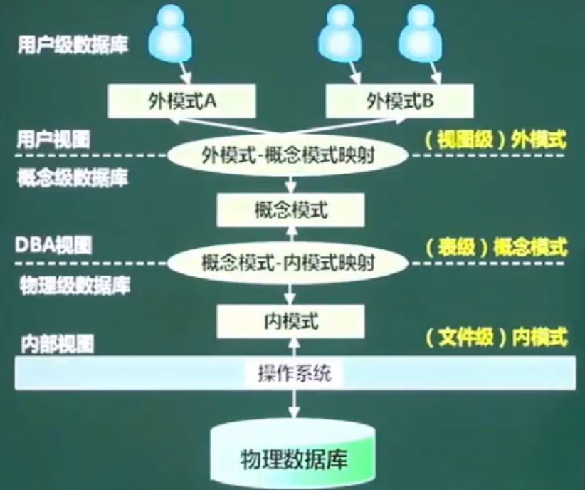 


所谓的三级模式指的是: 

**外模式(视图级)、概念模式(表级)、内模式(文件级)**

- **外模式:**

  **外模式又称为用户模式**, 外模式主要承接的是用户与应用程序打交道, 也就是说让用户操作数据库, 但是他看不到, 只能看到的是接口(即外模式是对数据的逻辑运算), 对于程序员来说也好, 对于用户也好, 只需要操作数据的逻辑就可以了,不需要关心里面是怎么样存储的、怎么设计的, 这些都不需要关心. 

- **内模式:**

  **又称为存储模式**,这个地方主要讲的就是数据结构的物理存储,主要考量的是数据怎样存比较好, 所以就有**分布式、共享等等**, 所以这不是我们要深入了解的.

- **概念模式:** 

  **概念模式也称为模**式,对于概念模式来说它不需要关心数据是怎样存储以及访问技术等,它只需要搞清楚自己要做的这个模式概念模式, 一般情况下形成的是表结构

上面介绍的就是我们数据库常说的三级模式. 这三级模式会有两层映射, 分别是: **外模式与概念模式的映射, 以及概念模式与内模式的映射,** 这两层映射的好处是让数据有更好的独立性, 也就是让我们的数据与程序分离(即分层解耦). 所以有了这两层映射的划分后就能保证数据的独立性, **数据的独立性**又分为数据的**物理独立性**和**数据的逻辑独立性.**

**数据的物理独立性主要讲的是概念模式与内模式这一层级**, 当数据在物理结构上发生了变化后, 这时因为我们有两层映射, 我们不需要去考虑上层变化, 对于用户来说它不知道发生了什么改变, 我们要做的东西就是做好内模拟与概念模式之间的映射关系即可

**对于数据的逻辑独立性**, 当我们程序操作了数据的逻辑结构, 这个逻辑结构一旦发生变化以后, 它的程序页不需要做太多的改变, 我们要改变的仅仅是外模式与概念模式之间的映射关系而已. 而对于应用程序上层来说都不需要修改. 


所以,对于三级模式和两级映射来说需要大家记住几个概念, **什么是三级模式, 什么是两层映射,以及中间衔接的数据是什么样的关系**. 

**记住:** 

**外模式承接的是 视图级, 概念模式承接的是表级, 内模式承接的文件级.** 


## 2、数据库设计过程

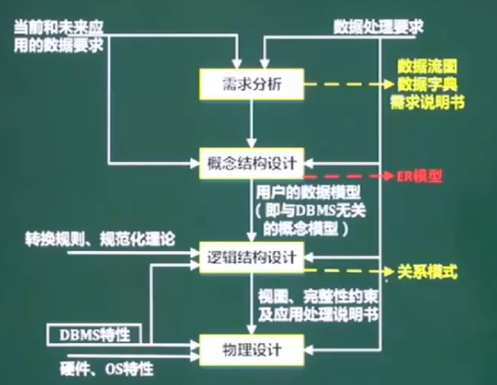 

这部分内容原本是应该在系统的开发与运行的部分, 这是属于高级的部分. 

数据库的设计分4个阶段: **需求分析、概念结构设计、逻辑结构设计、物理设计** 每个阶段都有不同的产物. 这些产物大家都需要了解写, 具体每个阶段怎么做我们暂时不需要了解. 如果你需要去做系统分析师,架构的话需要了解. 


- **需求分析:**

  所谓的需求分析, 就是根据用户的要求,将需求转化为**数据流图**和**数据字典**, 最终要输出的是**需求说明书.** 

  > 在这一环节中,为了更好的描述清楚这个应用到底要做什么功能, 要实现什么, 这时会引入**数据流图**进行描述.
  >
  > 简单的讲数据流图描述的就是数据的来源,以及流向和输出. 会把**外部实体**和**数据加工**和**存储**联系说清楚. 
  >
  > **数据字典**, 简单的说数据字典就是对数据流图进行简单的补充说明, 因为数据流图仅仅说的是数据是怎么样走的, 从哪里来到哪里去. **数据字典对数据进行了更加详细的说明, 到底是什么样的东西, 由那些部分组成的都说的很清楚.** 

- **概念结构设计:**

  概念结构分析输出的是**ER模型**

- **逻辑结构设计:**

  在逻辑结构设计这一环节, 会根据规范化理论和转化规则把**ER模型**转化为**关系模式**, 我们根据这个关系模式就可以建表(数据库的表)了. 

- **物理设计**:


上面我们介绍了数据库设计的过程, 分析为: **需求分析、概念结构设计、逻辑结构设计、物理设计** 这4个阶段, 也大致的介绍了每个阶段要做的事情以及输出, 在软考中我们要记住内个阶段的产出:

**需求分析**-> 产出 **数据流图**和**数据字**典, 最终形成**需求说明书**.

**概念结构设计** -> 产出**ER模型**

**逻辑结构设计** -> 产出 根据ER转化为 关系模型 , 最后建表

**物理设计:**


## 3、E-R模型 (重点)

### 1、什么是E-R模型 (重点)

E-R 模型, 中的E表示的是实体的意思, R 表示的是关系.

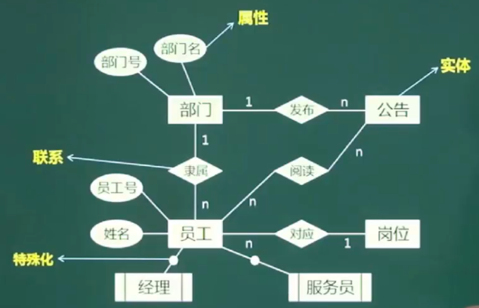 

上图就是E-R模型的图. ER 模型是一个重点, 在软考中上午和下午都要考. 在学习E-R模型前, 我们一定要搞清楚图标中的含义:


- **方框**, 代表的是实体(比如: 图中的**公告**)
- **椭圆形,** 代表的是属性或者特征
- **菱形,** 代表的是联系, 描述的是两个实体与实体之间是一个什么样的联系, 比如: 他们是一对一关系,一对多关系,多对多关系.
-  **带两条竖线的方框,** 表示的是弱实体(比如: 图中的**经理**), 这个弱实体是某种实体的特殊化, 所以你一般看见是 `--O--` 

所以ER模型反应的是实体与实体之间的关系, 在ER模型中有几个重点的部分, 他们之间的关系到底是一对一, 一对多, 还是多对多, 以及他们之间的关系把ER模型转化为关系模式到底要怎么转换. 


###  2、E-R模型--一对一的联系

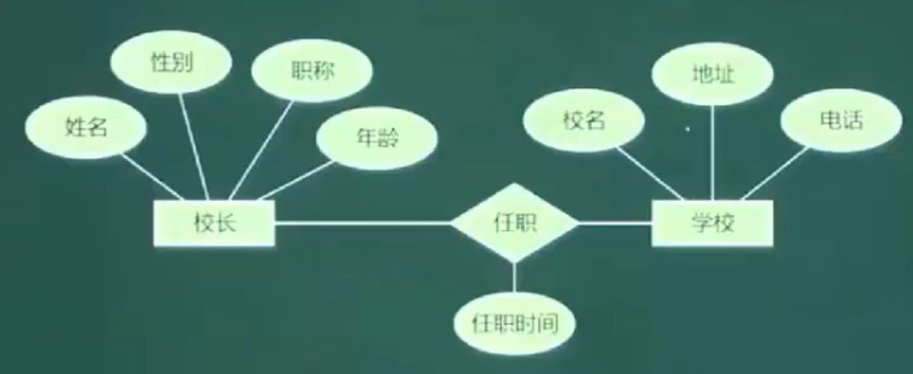 

一对一的联系, 比方说**校长**是一个**实体**, 有**姓名、性别、职称、年龄**这些属性. 然后**校长**与**学校**有个**一对一**的**任职联系**, 然后学校这个实体有校名、地址、电话这些属性. 校长与学校之间的一对一任职联系有个**任职时间**的属性

所以的话, 我们要将上面这个ER模型, 转换为关系模式. 如下:

- 对于校长这个实体来说 ,  有姓名、性别、职称、年龄4个属性, 我们建表如下:

  ```
  校长(姓名、性别、职称、年龄)
  ```

- 对于学校这个实体来说, 有校名、地址、电话3个属性,我们建表如下:

  ```
  学校(校名、地址、电话)
  ```

- 对于这个联系"任职"来说,有一个属性"任职时间", 但是联系它是建立与两个实体(校长与学校)之间的, 这两个实体的话我们要找一个属性能够代表这个实体, 就是我们后面要讲的主键(姓名和校名). 这样一来的话任职就能在校长与学校之间建立起 联系. 

  ```
  任职(任职时间、姓名、校长)
  ```

  

经过分析, 上面这个ER模型, 我们就可以转化为下面这两种关系模式:

- 第一种:

  ```
  校长(姓名、性别、职称、年龄、校名、任职时间)
  学校(校名、地址、电话)
  ```

- 第二种:

  ```
  校长(姓名、性别、职称、年龄)
  学校(校名、地址、电话、姓名、任职时间)
  ```

也就是说, 对于一对一这种联系 的话, 我们可以用两个关系模式就可以表述清楚这两个表达关系. 或者说这两个实体之间的关系. 

比如: 第一种方式中把联系并到校长这个实体这一端, 所以在校长的属性里面需要再增加两个属性: 任职时间和校名. 校名可以在学校的表中找到, 校名在学校的表中是主键, 在校长的表中就是外键. 

第二种方式把联系并到学校这个实体一端, 所以在学校这个实体里面需要增加任职时间和姓名属性.


### 3、E-R模型--一对多的联系

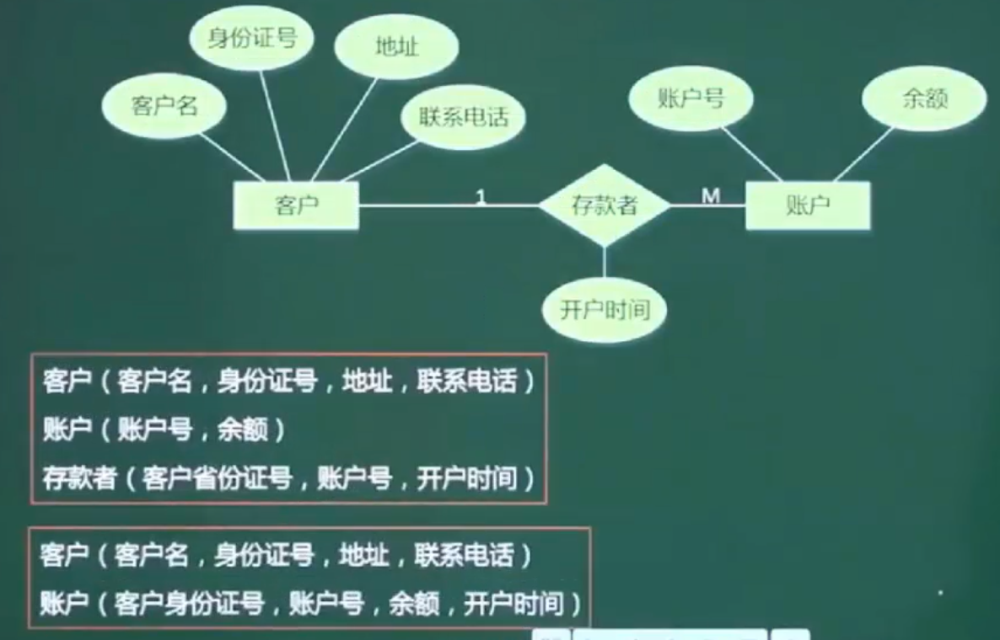 

一对多的ER模型, 关系并到多的一端. 


### 4、E-R模型--多对多的联系

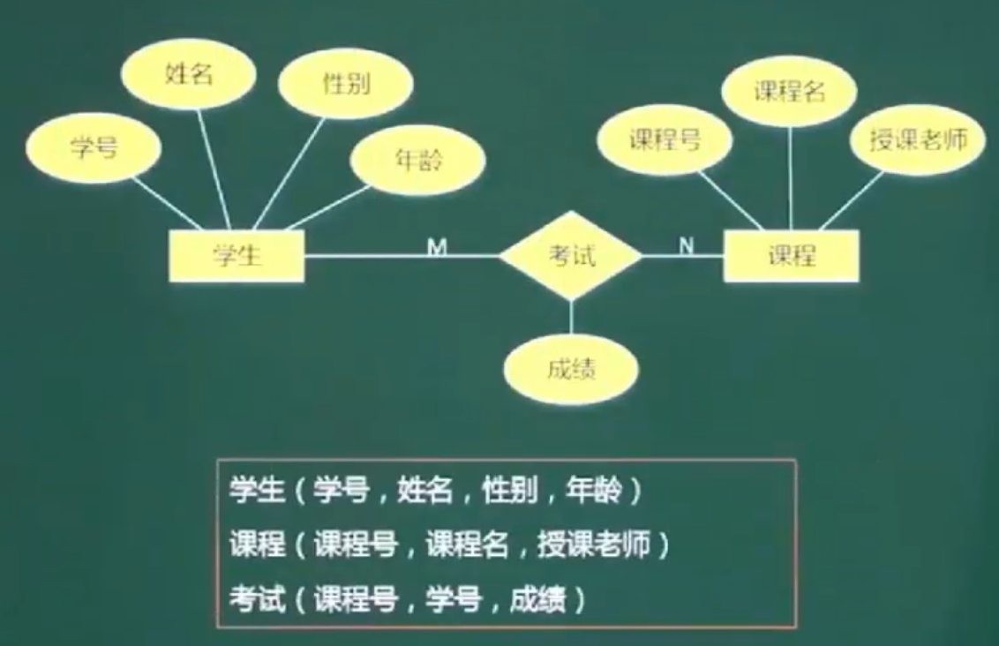 

上图中:

- 一个学生可以有多门课程(1 对 多)
- 一门课程可以有多个学生(1 对 多)

所以分析之后发现, 学生与课程之间的联系是 多 对 多.  对于这种多对多的联系,我们不能将联系简单的并在任何一端, **我们必须要将这种多对多的联系单独抽离到一张 联系表中. 才能够将这种关系表示清楚, 如上图**


### 5、E-R模型转关系映射总结

1. **一个实体 转换为 一个关系模式** (即, 一个实体需要设计一张表来存储所有的属性)

2. **联系转关系模式** (即, 联系转表字段)

   - **1对1联系时**, 可以将**联系**合并至任何一个实体关系模式, 当然单独写也没关系(单独写多张表而已)
   - **1对多联系时**, 可以将联系合并到多的实体关系模式中,当然单独写也没关系(单独写多张表而已)
   - **多对多联系:** 此时只能将联系单独转换成关系模式

3. 三个以上实体间的一个多元联系

   - 在数据库的逻辑结构的设计中, 将E-R模型转换为关系模型应遵循相关原则. 对于三个不同实体集合他们之间的多对多联系 m:n:p最少可转换成_ _ _ _ _ 个关系模式. 

      

     **答案是: C, 4个关系模式(4张表)**

     

> **简单的说:**
>
> E-R模型,表示的是实体与实体之间的联系,  描述的是属性与联系
>
> E-R模型转关系模式, 其实就是将E-R模型之间的属性关系,转换为数据库表存储的一种思维, 说白了E-R模型转关系模型就是我们平时说的理思路建表的意思. 


## 4、关系代数(重点)

在我们数据库的表操作中主要包含: **并集/ 交集/ 差集/ 笛卡尔积/ 投影/ 选择/ 联接**


### 1、关系代数--并/交/差

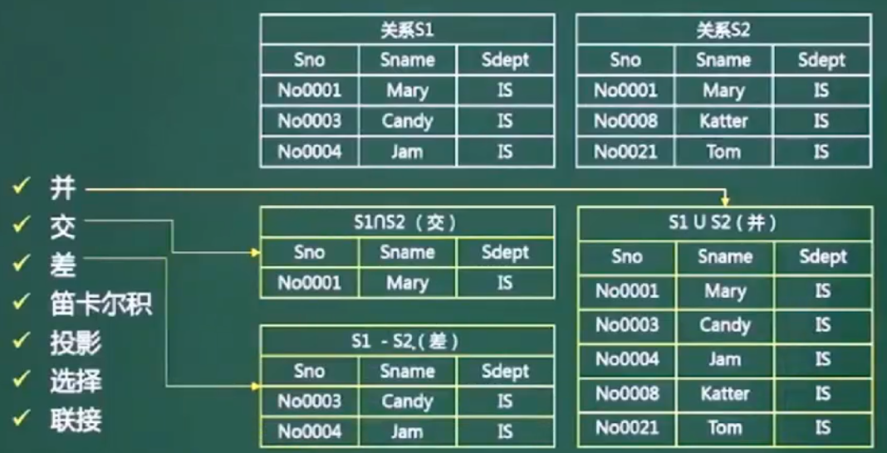 

关系代数是软考中上午题考的比较多的题型. 并、交、差 考的相对少些但是大家也必须掌握. 因为涉及到后面判断发现模式分解是有损还是无损都要用到这里面的内容. 因此 关系代数很重要. 


上图有2个关系: 关系S1 和 关系S2, 分别对应两张表他们且两张表里面的字段都是一样的: Sno、Sname、Sdept

- **并集:**

  对于并集来说, 就是如图中 **"S1 U S 2(并)"**表展示的内容, 将原本S1 和 S2中的数据直接合并起来即可.  合并前S1是3条记录,S2是三条记录,合并后一共是6条记录.  **6条记录也称为6个元祖**

- **交集:**

  对于交集, 就是将两个关系做交运算, 找出公共的部分. 如上图中 **"S1 n S2(交)"**表 中展示的内容. 

  **交集就是内容完全一样**

- **差集:**

  做差集的话, 需要搞清楚谁 在前谁在后, 比如上图中 **"S1 - S2(差)"** ,表达的意思是在 **S1** 的基础上去掉**S2**也有的记录, 结果剩下2条记录. 

上面就是我们关系代数讲的**并、交、差**, 很简单, **但是在做差运算时一定要搞清楚谁在前谁在后.** 


### 2、关系代数--笛卡尔积

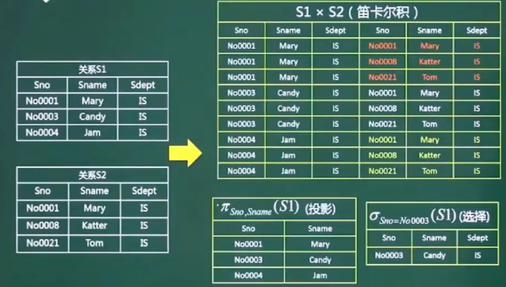 

笛卡尔积产生的记录, 会比我们之前讲的并/  交/ 差 多很多, 数量一下就膨胀起来了.  膨胀到 什么程度 呢?

我们来看下上面这张图, 左边是两张表 关系1 和 关系2, 他们都是三条记录, 一旦进行  笛卡尔积 计算的话,  生成的新表的数量就是两张表的乘积 3 \* 3  =  9; 

从上图我们发现,做笛卡尔积运算后新表是包含旧表中所有的字段的.  


### 3、关系代数--投影和选择

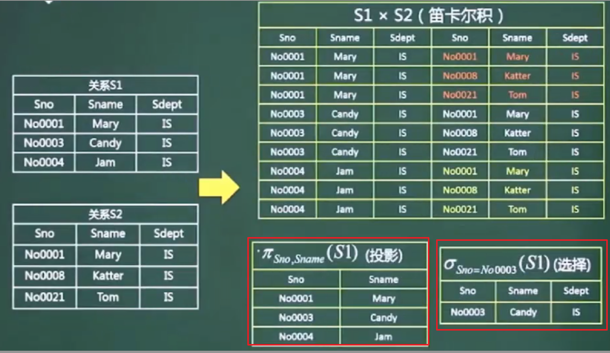  

上图中左边红色框内就是关系表S1的**投影**,   所谓**"投影"**就是只取关系表中的某些列的数据

上图中右边红色框内就是关系表 S2的**选择**,  所谓**"选择"**就是指获取关系表中的某些行(某些记录)


我们前面讲过**"笛卡尔积"**是对两个或多个关系(表)做乘法, 最后产生很多的新记录, 数据量很庞大. 有了投影和选择后,我们就可以将 **"笛卡尔积" 和  "投影" 和 "选择"** 一起运用, 这样就能对我们的笛卡尔积进行简化获取到我们想要的数据


### 4、关系代数--联接

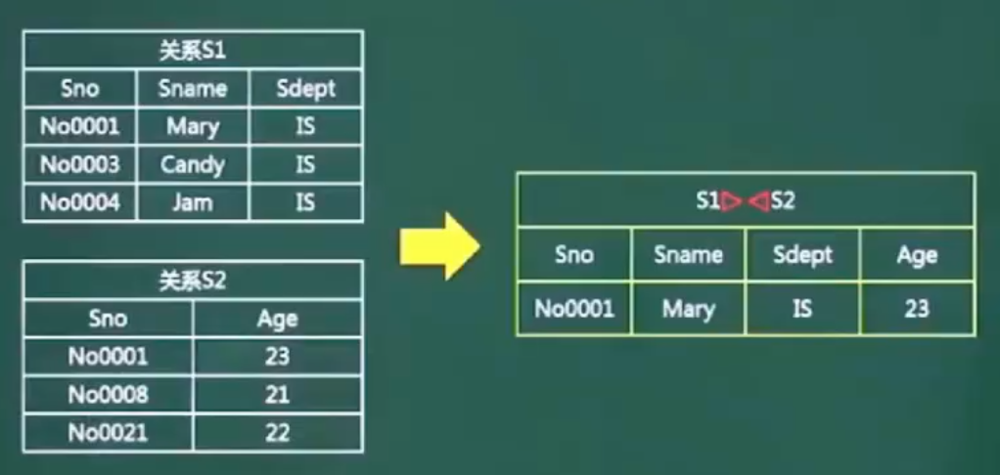 


接下来我们来看下**关系代数中的联接 (也称为自然联接).**

从上面的图,我们可以发现联接的操作,是**只取相同的记录**(主键相同), 

比如: 

关系S1中的Sno(No0001) 与 关系S2中的Sno(No0001) 是相同的, 因此两张表(两个关系)中的No0001记录被保留下来合并在一起, 其它的不要. 相同的属性只保留一个就行了. 也就是说联接(自然联接)计算去掉了重复的部分. 重复的 字段不要了, 重复的记录也不要了. 


**注意:**

关系代数中的联接, 联接的是多个关系表中主键一样的记录, 而关系代数中的交集是两个关系表中数据一样的, 两者不一样,这个要好好体会下. 


在我们的数据库操作中, 经常会把: **笛卡尔积/ 选择/ 投影/ 联接** 结合起来使用, 这个是我们平时开发和软考中经常的用法和考点.  


## 5、规范化理论

### 1、规范化理论--背景

 

**规范化理论.** 首先我们看到的是上面这样的一张关系模式表, 表里有很多重复的属性(字段)值, **这些重复的信息会产生下面的问题:**

- **数据冗余**
- **修改异常**
- **插入异常**
- **删除异常**

因为只要数据冗余, 我们在执行任何操作的时候都是全量的操作, 就可能导致修改异常/ 插入异常/ 删除异常, 你可以理解为只要数据量大就会带来各种各样的问题. 所以我们要对上面的这张表的内容进行规范化处理 . 也就是要对数据库进行规范化理论设计.  那对数据库进行设计要达到什么样的程度呢? 

我们在对数据库进行设计时, 要求不能有数据冗余, 这样就不会出现因为数据冗余造成的修改异常/ 插入异常/ 删除异常. 就避免了问题的发生. 

去除 数据库数据冗余的方案就是拆表,  比如: 上图中 数学课都是王一新老师来上, 我们可以将 "数学 王一新 五一路107号" 这些冗余信息拆到一个新的表中. 然后学生报这个老师的课程就行了嘛. 

 


### 2、规范化理论--设计(难啊~)

设R(U)是属性U上 的一个关系模式, X和Y是U的子集, r为R的任一关系, 如果对于r中的任意两个元祖(表记录) u,v 只要有u(X) = v(X), 就有 u(Y)=u(Y), 则称X函数决定Y, 或称Y函数依赖于X, 记为 X -> Y

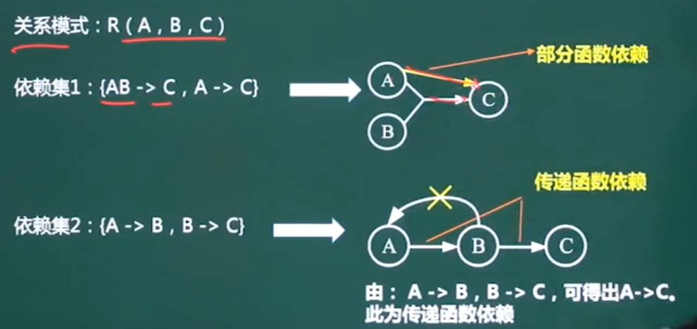  


### 3、规范化理论--键

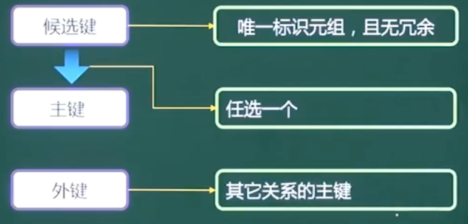 


- **候选键**

  能**唯一**表示元祖(即, 候选键可以唯一推导出某条记录), 且无冗余.  **且候选键可以有多个.**

  ```
  比如: 我们有张学生的表, 表里的字段如下
  -------------------------
  |学号 | 姓名 | 年龄 | 专业 |
  -------------------------
  学号可以推导出姓名,学号可以推导出年龄, 学号可以推导出专业
  
  那么这个学号字段就是一个候选键. 因为它能唯一标识出这个学生是谁. 通过它可以获取到学生的所有信息
  
  在比如: 学生表里可以增加一个 身份证号, 身份证号也可以唯一标识一个学生,通过身份证号也可以获取到唯一的一条记录(元祖),  因此候选键可以有多个
  ```

- **主键:** 

  候选键的基础上选主键, 在多个候选键中任意选择一个键作为主键. 主键只能有一个. 

- **外键:**

  外键就是其它关系模式(表)中的主键. 

**在关系模式(数据库表)中, 候选键对应的字段, 称为主属性.  不是候选键的就是非主属性.** 


### 4、规范化理论--求候选键

#### 1、图示法求候选键


1. 将关系的函数依赖关系, 用 **"有向图"** 的方式表示
2. 找出入度为0的属性, 并以该属性集合为起点, 尝试遍历有向图, 若能正常遍历图中所有结点,则该属性即为关系模式的候选键
3. 若入度为0的 属性集不能遍历图中所有结点, 则需要尝试性的将一些中间节点(即, 有入度, 页有出度的结点)并入入度为0的属性集中, 直至该集合能遍历所有结点, 集合为候选键 . 


